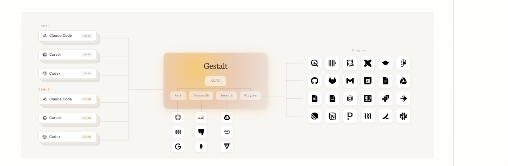

# Gestalt

[](https://github.com/valon-technologies/gestalt/issues)

> Gestalt is under active development. APIs and configuration may change between releases. Feedback and bug reports are welcome via [GitHub Issues](https://github.com/valon-technologies/gestalt/issues).

Gestalt is a self-hostable, open source platform for managing agentic tools and services, with declarative configuration and secure credential management built in.

## Why Gestalt

Agents need tools. Tools need auth. Auth needs credential storage, encryption, token refresh, and scoped access control. Every team building with agents ends up solving the same infrastructure problems before they can ship.

Gestalt handles this so individual agents and applications do not have to. A single YAML config declares which tools to expose, how users authenticate, and how credentials are managed.



### What Gestalt provides

- Credentials and connection data are encrypted at rest, on infrastructure you control.
- A single YAML config declaratively defines which tools to expose, how users authenticate, and how credentials are managed.
- The same operations are available over MCP, HTTP, CLI, and optional mounted web UIs for cloud agents, local coding assistants, and human operators.
- Auth backends, [IndexedDB](https://www.w3.org/TR/IndexedDB/) storage, secrets managers, caches, telemetry, audit sinks, and public web UIs are all provider packages.
- Deploy on infrastructure you control with Docker, Helm, or your own container platform.

## What Gestalt Is Not

Gestalt is not a SaaS platform. It is open source and self-hostable on infrastructure you control, so you keep ownership of your data, credentials, and deployment.

Gestalt also does not replace your existing APIs. It sits between agents and upstream services, handling auth and credential lifecycle while your APIs stay where they are.

## Quick Start

Tap the repository and install both binaries with Homebrew:

```sh
brew tap valon-technologies/gestalt https://github.com/valon-technologies/gestalt
brew install valon-technologies/gestalt/gestaltd
brew install valon-technologies/gestalt/gestalt
```

Start the server:

```sh
gestaltd
```

When no config file exists, `gestaltd` generates `~/.gestaltd/config.yaml`, starts with SQLite storage via the first-party [RelationalDB](https://github.com/valon-technologies/gestalt-providers/tree/main/indexeddb/relationaldb) provider, enables a default HTTPBin plugin, and listens on `http://localhost:8080`.

In a second terminal, connect the CLI to the server:

```sh
gestalt init
gestalt plugins list
gestalt plugins invoke httpbin get_ip
```

For the full walkthrough, see [Getting Started](https://gestaltd.ai/getting-started).

## Repository Layout

| Path | Description |
| --- | --- |
| [`gestaltd`](./gestaltd) | Go server daemon, config loading, provider bootstrap, HTTP API, MCP surface, deployment assets, and admin UI serving code. |
| [`gestalt`](./gestalt) | Rust CLI client for setup, auth, invocation, and token management. |
| [`sdk`](./sdk) | Go, Python, Rust, and TypeScript SDKs plus shared protocol definitions. |
| [`docs`](./docs) | Source for the public documentation site at [gestaltd.ai](https://gestaltd.ai). |
