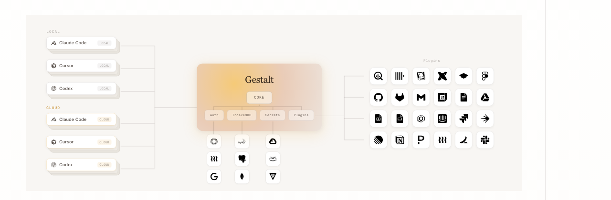

# Gestalt

[](https://github.com/valon-technologies/gestalt/issues)
[](LICENSE)
[](https://deepwiki.com/valon-technologies/gestalt)

> [!WARNING]
> Gestalt is under active development. APIs and configuration may change between releases. Feedback and bug reports are welcome via [GitHub Issues](https://github.com/valon-technologies/gestalt/issues).

> Gestalt (/ɡəˈʃtält/) refers to the idea that the whole is greater than the sum of its parts.

Gestalt is a self-hostable, open source platform for managing agentic tools and services, with declarative configuration and primitives for authentication and authorization. External REST/OpenAPI, GraphQL, MCP and executable custom-defined code are all supported, while exposing the same operation model to callers.

### Quick Demo
https://github.com/user-attachments/assets/08fd7bf3-cc9b-4436-ab71-418d6db4e6e7

## Why Gestalt

Gestalt is intentionally lightweight and technology-agnostic. Run it on a laptop or productionize it on a VM or container without buying into a specific cloud, database, or programming language. Tools can be external APIs, MCP servers, GraphQL, or executable code, and callers still get one operation model.

Add only what you need. Local deployments can run without external services or provider-backed dependencies: no authentication/authorization, no hosted runtime, and no mounted UI unless you configure them.

When you need production controls, add them through the [provider](https://gestaltd.ai/providers) ecosystem.



### What Gestalt provides

- **Plug-and-play [providers](https://gestaltd.ai/providers).** Inspired by [Terraform providers](https://developer.hashicorp.com/terraform/language/providers), so you add only what you need.
- **A unified tool surface for agents.** The same operations are exposed over MCP, HTTP, and CLI, usable by cloud agents, local coding assistants, and human operators. See [Plugin](https://gestaltd.ai/providers/plugins).
- **Authentication and Authorization as primitives.** [Authentication](https://gestaltd.ai/providers/authentication) flows, [credential storage](https://gestaltd.ai/providers/external-credentials), encryption at rest, token refresh, and [RBAC](https://gestaltd.ai/providers/authorization) run on infrastructure you control.
- **Declarative configuration.** A single YAML config defines tools, auth flows, connections, agents, workflows, and schedules.
- **Observability and audit logging.** [OpenTelemetry](https://opentelemetry.io/) compatible [observability](https://gestaltd.ai/observability) and [audit logging](https://gestaltd.ai/audit-logging).
- **Runtimes.** [Runtimes](https://gestaltd.ai/providers/runtime) provide agent and code sandboxing.*
- **Workflows and agents.** [Workflows](https://gestaltd.ai/providers/workflow) and [agents](https://gestaltd.ai/providers/agent) run with durable state, retries, and delegated invocations.†

\* Runtimes are an alpha feature, and not yet stable.

† Workflows and agents are both alpha features, and not yet stable.

## What Gestalt Is Not

Gestalt is not a SaaS platform. It is open source and self-hostable on infrastructure you control, so you keep ownership of your data, credentials, and deployment.

Gestalt is not a mono-repo with hundreds or thousands of integrations built out-of-the-box. You configure exactly what you need. Gestalt is not an agent harness, but it provides first-class support for Claude Code, Codex, and Cursor.

## Quick Start

Install the server and CLI with the installer scripts:

```sh
curl -fsSL https://gestaltd.ai/install-gestaltd.sh | sh
curl -fsSL https://gestaltd.ai/install-gestalt.sh | sh
```

Or use Homebrew:

```sh
brew tap valon-technologies/gestalt
brew install valon-technologies/gestalt/gestaltd
brew install valon-technologies/gestalt/gestalt
```

Start the server:

```sh
gestaltd
```

When no config file exists, `gestaltd` generates `~/.gestaltd/config.yaml`, starts with SQLite storage via the first-party [RelationalDB](https://github.com/valon-technologies/gestalt-providers/tree/main/indexeddb/relationaldb) provider, mounts the default UI at `/`, enables a default HTTPBin plugin, and listens on `http://localhost:8080`.

In a second terminal, connect the CLI to the server:

```sh
gestalt init
gestalt plugin list
gestalt plugin invoke httpbin get_ip
```

For the full walkthrough, see [Getting Started](https://gestaltd.ai/getting-started).

## Repository Layout

| Path | Description |
| --- | --- |
| [`gestaltd`](./gestaltd) | Go server daemon, config loading, provider bootstrap, HTTP API, MCP surface, deployment assets, and admin UI serving code. |
| [`gestalt`](./gestalt) | Rust CLI client for setup, auth, plugin invocation, workflow and agent runs, and token management. |
| [`sdk`](./sdk) | Go, Python, Rust, and TypeScript SDKs plus shared protocol definitions. |
| [`docs`](./docs) | Source for the public documentation site at [gestaltd.ai](https://gestaltd.ai). |
