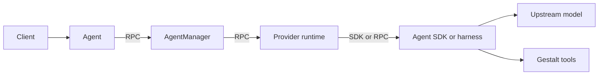
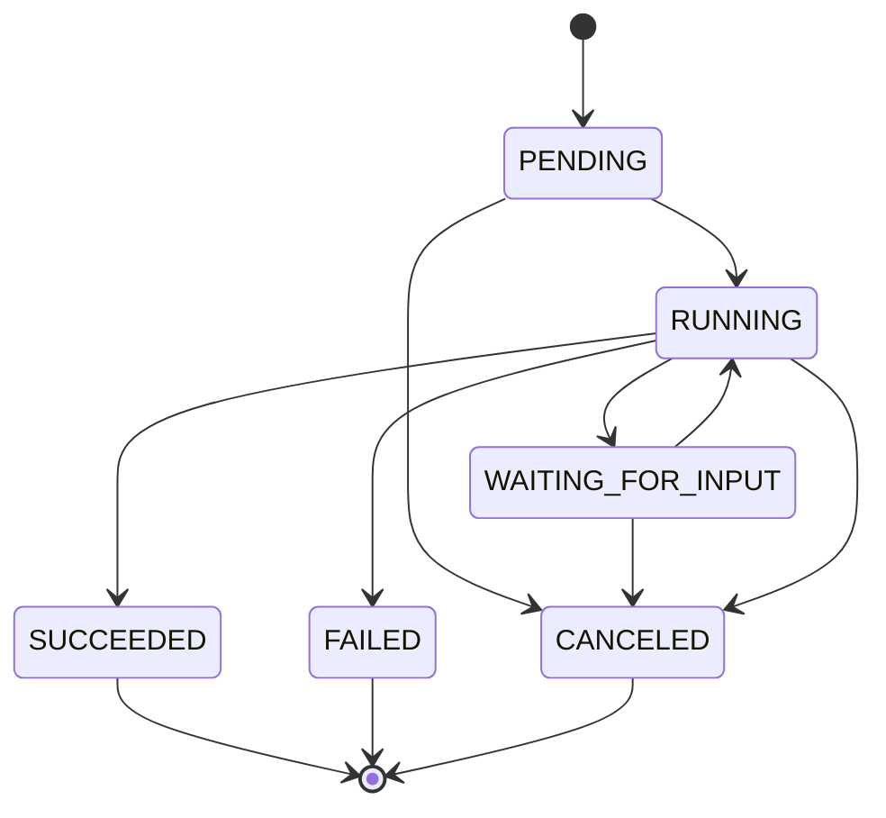
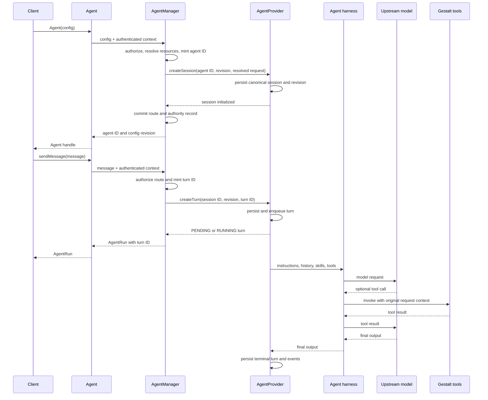

# AgentProvider interface redesign

> **Status: proposed v1 contract.** The interfaces below define the target
> behavior for the public SDK, Gestalt control plane, and provider protocol.
> Language-specific and protobuf definitions may use idiomatic names while
> preserving these semantics.

## Purpose

`AgentProvider` is Gestalt's adapter to an agent runtime such as Claude Agent
SDK, OpenAI Agents SDK, Codex, or a custom model loop. It is a provider
runtime, not the SDK or harness itself: its implementation calls the selected
SDK or remote harness.

Clients use the `Agent` class. They do not call a provider directly. Gestalt
authenticates the caller, resolves tools and skills, and then calls the selected
provider.



Gestalt owns identity, authorization, tool and skill selection, workspace
validation, provider routing, and delegated tool authority. It keeps a minimal
route and authority record so an agent ID can be reauthorized and routed after
a restart. The provider owns the canonical session, configuration revisions,
turns, ordered events, interactions, results, provider-native state, model
execution, and cancellation. The client SDK presents the session through an
`Agent` instance instead of requiring callers to manage it separately.

## Client-facing `Agent` class

Creating an agent also creates its initial session. The returned `Agent` is the
handle for that one conversation: subsequent `sendMessage` calls retain its
history, tool scope, skill scope, and workspace. A caller only needs the agent
ID when it wants to resume an existing conversation in a later process or list
durable conversation records.

```ts
interface Agent {
  /** Opaque ID of the durable conversation. It does not grant access by itself. */
  readonly id: string;
  /** Current immutable configuration revision used for compare-and-swap updates. */
  readonly configRevision: string;

  sendMessage(
    message: string,
    options?: AgentSendMessageOptions,
  ): Promise<AgentRun>;
  getRun(runId: string): Promise<AgentRun>;
  updateConfig(request: AgentConfigUpdate): Promise<AgentConfigRevision>;
}
```

`Agent` is one asynchronous function with two input shapes: configuration
creates a new durable conversation, while an ID reconnects to an existing one.

```ts
interface AgentCreateInput extends AgentConfig {
  idempotencyKey?: string;
}

type AgentInit = AgentCreateInput | { id: string };

declare function Agent(input: AgentInit): Promise<Agent>;

const agent = await Agent({
  model: "gpt-5.5",
  instructions: "...",
  tools: { /* ... */ },
  skills: { /* ... */ },
});

const run = await agent.sendMessage("Fix the test");

// In a later process or HTTP request:
const resumed = await Agent({ id: agent.id });
```

When given configuration, the function creates the durable session and returns
the conversation handle. When given an ID, it reauthorizes the caller and
returns a handle for the existing session. There is no need for callers to
explicitly create, fetch, or list sessions while they are using an agent
normally.

For an HTTP client, `id` is the value carried across otherwise stateless
requests:

```http
POST /agents
→ { "id": "agent_123", "configRevision": "rev_1" }

POST /agents/agent_123/runs
→ starts the next turn in the same conversation
```

The ID identifies the conversation but is not a credential. Gestalt
reauthorizes the authenticated caller whenever the ID is used.

The main request shapes are:

```ts
interface AgentConfig {
  providerName?: string;
  model?: string;
  instructions?: string;
  tools?: AgentToolConfig;
  skills?: AgentSkillConfig;
  workspace?: AgentWorkspace;
}

interface AgentConfigUpdate {
  model?: string;
  instructions?: string;
  tools?: AgentToolUpdate;
  skills?: AgentSkillUpdate;
}

interface AgentSendMessageOptions {
  idempotencyKey?: string;
}

interface AgentConfigRevision {
  id: string;
  createdAt: Date;
}

interface AgentToolUpdate {
  replace?: AgentToolConfig;
  add?: AgentToolRef[];
  remove?: AgentToolRef[];
}

interface AgentRun extends AsyncIterable<AgentTurnEvent> {
  /** ID of this one in-flight or completed turn. */
  readonly id: string;
  readonly status: AgentTurnStatus;
  /** Resolves when the turn reaches a terminal state. */
  readonly result: Promise<AgentResult>;

  cancel(reason?: string): Promise<void>;
  listPendingInteractions(): Promise<AgentInteraction[]>;
  respond(
    interactionId: string,
    resolution: AgentInteractionResolution,
  ): Promise<void>;
}

interface AgentResult {
  turn: AgentTurn;
  text: string;
  structured?: JsonValue;
}
```

`sendMessage` accepts a string and always authors a user message. The public
caller cannot impersonate an assistant, system instruction, or tool result.
Role-bearing `AgentMessage` values remain internal to persisted history and the
provider protocol. Model selection, instructions, tools, skills, and workspace
are session configuration and are never repeated on individual messages.

`providerName` is an optional creation-time routing key for a configured
`AgentProvider` implementation, such as `claude-production`. AgentManager
resolves it to a provider endpoint and stores that choice on the durable
record. Later messages use only the agent ID and cannot switch providers.

`updateConfig` is the canonical transport operation so several fields can
change atomically in one new configuration revision. Tool and skill updates
must explicitly say `replace`, `add`, or `remove`; `replace` cannot be combined
with the other operations. SDKs may expose convenience methods such as
`setModel`, `setSkills`, `addSkills`, `setTools`, and `addTools`, but those are
thin wrappers around `updateConfig`, not separate provider RPCs.

The SDK sends `agent.configRevision` as the expected revision on every
`updateConfig` call. On success it replaces the handle's current revision and
returns the new immutable revision. If another handle updated the agent first,
the operation returns a conflict; it never silently overwrites the newer
configuration.

`workspace` is an optional, creation-only coding-agent extension. A
conversation remains bound to the same logical workspace for its lifetime.
Callers create another agent instead of moving existing history and authority
to a different filesystem.

### Function lifecycle

| Function | What it does |
| --- | --- |
| `Agent(config)` | Selects a provider, authorizes and resolves tools/skills, validates the optional workspace, persists an initial session, and returns an agent bound to it. Expensive runtime and workspace materialization may wait until the first message. |
| `Agent({ id })` | Reauthorizes the caller and returns a new local handle for an existing durable conversation. |
| `sendMessage` | Creates a durable turn in the agent's bound session, starts execution, and returns a streamable run. The run yields progress and terminal events. |
| `getRun` | Reauthorizes and reconstructs a run handle after process or stream disconnection. Its iterator replays durable events. |
| `updateConfig` | Compare-and-swaps the current configuration to the next immutable revision. It affects future turns only. |
| `AgentRun.cancel` | Records cancellation and signals the active model or harness. |
| `AgentRun.listPendingInteractions` | Returns unresolved approval or input requests for reconnect recovery. |
| `AgentRun.respond` | Resolves a specific approval or input request inside the existing run, allowing that same turn to continue. It does not create a new turn. |

Text is received in either of two ways:

```ts
const run = await agent.sendMessage("Fix the test");

// Render text as it arrives, then receive a terminal event.
for await (const event of run) {
  if (event.type === "text_delta") render(event.text);
  if (event.type === "turn_completed") console.log(event.result.text);
}

const result = await run.result;
console.log(result.text);
```

The internal service still exposes turn reads, event replay, and interaction
listing for recovery, administration, and UIs. They are deliberately not part
of the normal conversation API.

### Trade-offs of an agent-owned session

This design is the right default for an interactive SDK: the caller has one
object to configure and prompt, while the returned run owns cancellation and
interaction handling. It prevents a common error
where a turn is accidentally sent to the wrong session, and it matches the
native shape of both a live Claude client and a Codex thread.

It has costs:

| Trade-off | Consequence | Mitigation |
| --- | --- | --- |
| Creation has a durable side effect | `Agent(config)` can leave an unused session when a caller abandons the handle. | Make it idempotent, archive/expire unused sessions, and do not allocate a native harness until the first message. |
| One agent means one conversation | Concurrent or unrelated conversations require separate agent instances. | Make `Agent(config)` cheap; create multiple agents deliberately. |
| Configuration becomes session-scoped | Changing instructions, tools, or skills mid-conversation can invalidate prior assumptions. | `updateConfig` creates a revision. A running turn keeps its existing revision; every later turn records the revision it used. Workspace is creation-only. |
| Resume remains a real need | A process can die while the conversation and its work remain durable. | Recreate the local handle with `Agent({ id })`; keep session listing as an internal or optional management API. |

The REST and provider protocols may therefore remain session-and-turn based.
The ergonomic `Agent` object is an SDK façade over those durable resources,
not a replacement for them.

## Provider-facing `AgentProvider`
```ts
interface AgentProvider extends Provider {
  createSession(request: ProviderCreateSession): Promise<AgentSession>;
  getSession(request: ProviderGetSession): Promise<AgentSession>;
  listSessions(request: ProviderListSessions): Promise<AgentSession[]>;
  archiveSession(request: ProviderArchiveSession): Promise<AgentSession>;
  createConfigRevision(
    request: ProviderCreateConfigRevision,
  ): Promise<ResolvedAgentConfigRevision>;

  createTurn(request: ProviderCreateTurn): Promise<AgentTurn>;
  getTurn(request: ProviderGetTurn): Promise<AgentTurn>;
  listTurns(request: ProviderListTurns): Promise<AgentTurn[]>;
  cancelTurn(request: ProviderCancelTurn): Promise<AgentTurn>;
  listTurnEvents(request: ProviderListTurnEvents): Promise<AgentTurnEvent[]>;

  getInteraction(request: ProviderGetInteraction): Promise<AgentInteraction>;
  listInteractions(request: ProviderListInteractions): Promise<AgentInteraction[]>;
  resolveInteraction(request: ProviderResolveInteraction): Promise<AgentInteraction>;

  getCapabilities(): Promise<AgentProviderCapabilities>;
}
```

These session methods are internal service and provider operations, not methods
on the client-facing `Agent`. `listSessions` returns durable records for
history, administration, retention, and recovery:

```ts
interface AgentSession {
  id: string;
  providerName: string;
  model: string;
  state: "ACTIVE" | "ARCHIVED";
  configRevision: string;
  createdBySubjectId: string;
  createdAt: Date;
  updatedAt: Date;
  lastTurnAt?: Date;
}
```

An `AgentSession` is the canonical durable conversation record. It is not the
same thing as the local `Agent` handle and is not returned from normal
`sendMessage` calls. The public `agent.id` is this record's `id`; there is no
second client reference or conversation identifier.

The provider receives more than the public client supplied:

```ts
interface ProviderCreateSession {
  sessionId: string;
  idempotencyKey: string;
  initialConfig: ResolvedAgentConfigRevision;
  requestContext: RequestContext;
}

interface ProviderCreateConfigRevision {
  sessionId: string;
  idempotencyKey: string;
  expectedRevision: string;
  nextConfig: ResolvedAgentConfigRevision;
  requestContext: RequestContext;
}

interface ResolvedAgentConfigRevision {
  id: string;
  parentRevision?: string;
  model?: string;
  instructions?: string;
  resolvedTools: ResolvedAgentTool[];
  resolvedSkills: ResolvedAgentSkill[];
  resolvedWorkspace?: ResolvedAgentWorkspace;
  historyPolicy?: AgentHistoryPolicy;
  createdAt: Date;
}

interface ProviderCreateTurn {
  sessionId: string;
  turnId: string;
  executionRef: string;
  message: AgentMessage;
  configRevision: string;
  requestContext: RequestContext;
}
```

Public selectors are never forwarded as if they were resolved authority.
AgentManager turns public tool and skill selectors into the immutable resolved
configuration above. `createConfigRevision` atomically succeeds only when
`expectedRevision` is still current. Each turn inherits one revision and cannot
add new capabilities. A skill may change what the model is taught, but never
grants additional tool access. `archiveSession` changes only lifecycle
visibility; archived history and events remain readable according to retention
policy.

### Why the provider still has sessions

The client-facing `Agent` and the provider-facing session are intentionally not
the same abstraction. `Agent` is a convenient, in-process handle. A session is
the provider-owned durable conversation record that survives process restarts
and associates history, configuration, events, interactions, cancellation, and
idempotency with the right conversation. The SDK keeps that record private for
the common case.

The provider serves canonical lifecycle reads without requiring a live model
worker, sandbox, pod IP, tunnel, or transport attachment. Gestalt's route index
contains only the agent ID, authenticated owner and tenant, selected provider,
current configuration revision pointer, lifecycle visibility, and authority
references needed to locate and safely invoke that provider. It does not copy
conversation history, events, results, or interactions.

The client-facing `Agent` never contacts an `AgentProvider` directly. It sends
the agent ID and caller request context to AgentManager. AgentManager loads the
route, authorizes the caller, selects the stored provider and configuration
revision, and makes the provider RPC. Exact reads use that route. Cross-agent
management lists first select authorized routes and then fetch provider-owned
records; a provider record never decides who may see it.

`createTurn` must persist the turn and return quickly. The model loop runs in a
background worker. Read operations must continue to work after that worker or
sandbox exits.

## Context, tools, and skills

"Context" has several meanings that must remain separate:

| Kind | Contents | Model sees it? |
| --- | --- | --- |
| Request context | Caller identity, request ID, credentials, authorization, session and turn IDs | No |
| Model context | Instructions, conversation history, and supplied documents or data | Yes |
| Tool scope | Operations the caller is authorized to invoke | Descriptions only |
| Skill scope | Available skill names, descriptions, and resources | Loaded when relevant |
| Workspace | Checkout, working directory, and sandbox files | Through agent tools |
| Provider state | Native conversation handles and execution bookkeeping | No |

`workspace` identifies the sandboxed filesystem environment available to a
coding agent. It may describe Git checkouts, their refs and destination paths,
and the working directory inside the prepared workspace:

```ts
interface AgentWorkspace {
  checkouts: Array<{
    url: string;
    ref?: string;
    path: string;
  }>;
  cwd: string;
}
```

For an HTTP client, these are logical checkout and workspace-relative values,
not arbitrary paths on the Gestalt host. A non-coding agent normally omits the
workspace. Gestalt validates the specification against runtime policy and
resolves it to an opaque materialization handle:

```ts
interface ResolvedAgentWorkspace {
  id: string;
  materializationRef: string;
  cwd: string;
}
```

The provider uses that handle to attach its sandbox to the prepared workspace.
Host paths and repository credentials do not cross the public API or become
model context. Providers that do not advertise workspace support reject the
configuration before a session is created. Workspace materialization should be
lazy when possible so an unused session does not clone repositories.

The public v1 API has no arbitrary caller `metadata` bag. Applications keep
their own mapping from a business object to `agent.id`. If Gestalt later needs
searchable management labels, it should add a bounded string-to-string
`labels` field with explicit indexing and retention semantics rather than
using untyped JSON. Internal lifecycle, routing, and authority data always use
typed or reserved protocol fields.

The `Agent` class automatically captures request context from the authenticated
Gestalt request. A caller cannot provide or override it.

When a model calls a tool, the provider invokes the resolved Gestalt operation
using the original request context. Model-generated arguments cannot change the
caller, credential, connection, app, or operation.

Skills should use logical marketplace references rather than filesystem paths:

```ts
interface AgentSkillConfig {
  refs: Array<{
    marketplace?: string;
    package: string;
    skill: string;
    version?: string;
  }>;
}

interface AgentSkillUpdate {
  replace?: AgentSkillConfig["refs"];
  add?: AgentSkillConfig["refs"];
  remove?: AgentSkillConfig["refs"];
}
```

A skill package is a versioned distribution artifact that may contain one or
more named skills and their supporting resources. `package` is used instead of
the ambiguous term `bundle`; `skill` selects one skill within that package.

Gestalt resolves each reference to an immutable version and gives the provider
a materialization handle. The provider adapts that to Claude plugins, Codex
skills, OpenAI sandbox skills, or another native mechanism. Skill metadata is
available for discovery; full instructions load only when needed. Updating
skills produces a new resolved skill set in a new configuration revision and
applies only to later turns.

A skill may explain how to use a tool, but it never grants access to that tool.

## Durable resources and state

The provider persists four portable resources in addition to its native SDK or
harness state:

| Resource | Identity and lifecycle |
| --- | --- |
| Session | One durable conversation, identified by the Gestalt-minted agent ID. It is `ACTIVE` or `ARCHIVED`. |
| Configuration revision | Immutable model, instructions, resolved tools, resolved skills, and workspace binding. A session points to its current revision. |
| Turn | One `sendMessage` execution. It captures exactly one configuration revision. |
| Interaction | One approval or input request inside a turn. It is pending until resolved or canceled. |

```ts
type AgentTurnStatus =
  | "PENDING"
  | "RUNNING"
  | "WAITING_FOR_INPUT"
  | "SUCCEEDED"
  | "FAILED"
  | "CANCELED";

interface AgentTurn {
  id: string;
  sessionId: string;
  configRevision: string;
  status: AgentTurnStatus;
  statusMessage?: string;
  output?: {
    text: string;
    structured?: JsonValue;
  };
  createdAt: Date;
  startedAt?: Date;
  completedAt?: Date;
}

type AgentTurnEventType =
  | "turn_created"
  | "turn_started"
  | "text_delta"
  | "tool_call_requested"
  | "tool_call_completed"
  | "interaction_requested"
  | "interaction_resolved"
  | "history_compacted"
  | "turn_completed"
  | "turn_failed"
  | "turn_canceled";

interface AgentEventDisplay {
  text?: string;
  label?: string;
  phase?: string;
}

interface AgentTurnEvent {
  id: string;
  cursor: string;
  sequence: number;
  sessionId: string;
  turnId: string;
  type: AgentTurnEventType;
  occurredAt: Date;
  display?: AgentEventDisplay;
  payloadRef?: string;
}

interface AgentHistoryPolicy {
  strategy: string;
  maxContextTokens?: number;
}
```

Turn state transitions are:



`SUCCEEDED`, `FAILED`, and `CANCELED` are terminal and immutable. Creating a
turn persists it before execution is scheduled and returns `PENDING` or
`RUNNING`; the create RPC never waits for model completion. A client deadline
only stops that client from waiting. It does not cancel the durable turn.

Every turn event has a stable ID, session ID, turn ID, monotonically increasing
sequence, opaque replay cursor, event type, and timestamp. Portable event types
are:

- `turn_created`
- `turn_started`
- `text_delta`
- `tool_call_requested`
- `tool_call_completed`
- `interaction_requested`
- `interaction_resolved`
- `history_compacted`
- `turn_completed`
- `turn_failed`
- `turn_canceled`

The provider returns events in sequence order. Supplying a cursor returns only
events after that cursor. Replaying the same cursor may return the same page but
must never skip an event; clients deduplicate by event ID. A terminal event and
the terminal turn record must agree.

Portable events persist IDs, state, timestamps, safe display text, and redacted
summaries. Raw prompts, tool arguments, tool results, model reasoning, and
other sensitive payloads are not copied into the general event log. If policy
allows retention, an event contains an access-controlled payload reference
whose read path reauthorizes the caller and applies the configured retention
period.

Providers choose how to truncate or summarize model history. The selected
policy is recorded on the configuration revision, and each compaction produces
a `history_compacted` event describing which history range was replaced
without exposing raw discarded content. V1 does not standardize the
summarization algorithm.

## Human interactions

There are two interaction kinds:

```ts
interface AgentInteractionBase {
  id: string;
  sessionId: string;
  turnId: string;
  state: "PENDING" | "RESOLVED" | "CANCELED";
  title: string;
  createdAt: Date;
  resolvedAt?: Date;
}

type AgentInteraction = AgentInteractionBase &
  (
    | {
      kind: "approval";
      action: string;
      description?: string;
      argumentsSummary?: JsonValue;
    }
    | {
      kind: "input";
      prompt: string;
      input:
        | { type: "text"; multiline?: boolean }
        | { type: "choice"; choices: Array<{ value: string; label: string }> }
        | { type: "json"; schema: JsonObject };
    }
  );

type AgentInteractionResolution =
  | { decision: "approve" | "deny"; reason?: string }
  | { value: JsonValue };
```

A clarification is an `input` interaction with text input, not a third
protocol kind. When the provider creates an interaction it persists the
interaction and `interaction_requested` event before moving the turn to
`WAITING_FOR_INPUT`. `AgentRun.result` remains pending.

A live SDK observes the event and calls
`run.respond(interactionId, resolution)`. A reconnecting HTTP client lists
unresolved interactions by agent and run ID, then resolves the same resource.
The resolve operation reauthorizes the caller, verifies that the interaction
belongs to the active turn, persists the resolution, emits
`interaction_resolved`, and resumes that same turn. Repeating the identical
resolution succeeds; a different resolution for an already resolved
interaction returns a conflict.

## Capabilities

Every compatible provider implements the durable lifecycle core:

- session create, get, list, and archive;
- immutable configuration revisions and compare-and-swap update;
- turn create, get, list, terminal result, and cancellation;
- ordered durable event replay;
- capability discovery and protocol-version negotiation.

The provider advertises optional capabilities independently:

```ts
interface AgentProviderCapabilities {
  protocolVersion: string;
  tools: boolean;
  skills: boolean;
  interactions: boolean;
  structuredOutput: boolean;
  workspaces: boolean;
  parallelToolCalls: boolean;
  reasoningSummaries: boolean;
}
```

Gestalt checks capabilities before creating a session or configuration revision
that needs them. Unsupported configuration returns a typed failed-precondition
error before any partial provider state is created. A capability describes
behavior the conformance suite can verify, not merely a provider preference.

## Control-plane and HTTP surface

The authenticated `AgentService` exposes the resource operations needed by the
SDK facade and recovery clients. The HTTP mapping is:

| Operation | HTTP |
| --- | --- |
| Create agent | `POST /api/v1/agents` with `Idempotency-Key` |
| Resume/read agent | `GET /api/v1/agents/{agentId}` |
| Compare-and-swap configuration | `PATCH /api/v1/agents/{agentId}/config` with `If-Match` |
| Create run | `POST /api/v1/agents/{agentId}/runs` with `Idempotency-Key` |
| Read run/result | `GET /api/v1/agents/{agentId}/runs/{runId}` |
| Cancel run | `POST /api/v1/agents/{agentId}/runs/{runId}/cancel` |
| Poll or stream events | `GET /api/v1/agents/{agentId}/runs/{runId}/events?after={cursor}` |
| List pending interactions | `GET /api/v1/agents/{agentId}/runs/{runId}/interactions?state=pending` |
| Resolve interaction | `POST /api/v1/agents/{agentId}/runs/{runId}/interactions/{interactionId}/resolve` |

The events endpoint returns a page for an ordinary request and the same durable
log as Server-Sent Events when the client requests `text/event-stream`. An SSE
reconnect supplies the last acknowledged cursor. Disconnecting an SSE stream
does not cancel the run.

Agent and run list operations may exist for administrative UIs, retention, and
history views. They use opaque cursors and authorized route selection; they are
not methods on the minimal `Agent` facade.

## Network, authorization, and failure semantics

There are two independent network calls:

1. The client SDK calls Gestalt's authenticated `AgentService`.
2. AgentManager calls the selected remote `AgentProvider` using authenticated
   service identity and scoped delegated context.

The public caller cannot provide `RequestContext`, subject identity, provider
credentials, resolved tools, skill materialization handles, or workspace
materialization handles. AgentManager derives them after authorization. A
provider request is bound to the selected provider, agent ID, turn ID,
configuration revision, caller, tenant, and request ID. Model-generated tool
arguments cannot modify any of those fields.

Gestalt mints agent and turn IDs before calling the provider. The provider
accepts those IDs and makes creation idempotent:

| Mutation | Retry and concurrency rule |
| --- | --- |
| Create agent | `Idempotency-Key` is scoped to authenticated caller and route. A replay returns the same agent. |
| Create run | `Idempotency-Key` is scoped to the agent. A replay returns the same turn. |
| Update configuration | `If-Match` must equal the current revision. A stale revision returns conflict. |
| Cancel run | Repeating cancellation returns the current canceled or terminal turn. |
| Resolve interaction | An identical retry succeeds; a different second resolution returns conflict. |

If the provider succeeds but Gestalt loses the response, Gestalt retries the
same provider mutation with the same stable IDs and idempotency key before
committing or repairing its route record. A partially created route is never
visible to an unauthorized caller.

Portable failures use these categories consistently across protobuf, HTTP, and
SDKs:

| Category | Meaning |
| --- | --- |
| `INVALID_ARGUMENT` | Malformed configuration, message, cursor, or resolution. |
| `UNAUTHENTICATED` | No valid caller or service identity. |
| `PERMISSION_DENIED` | Authenticated caller lacks authority. Resource reads may return `NOT_FOUND` instead to avoid disclosure. |
| `NOT_FOUND` | No visible agent, turn, event cursor, or interaction. |
| `CONFLICT` | Stale configuration revision or conflicting interaction resolution. |
| `FAILED_PRECONDITION` | Requested provider capability is unsupported or the resource state disallows the operation. |
| `UNAVAILABLE` | Durable state exists but Gestalt, the provider, or its execution runtime cannot currently attach. |
| `DEADLINE_EXCEEDED` | The current RPC wait expired; it does not imply turn cancellation. |

The provider protocol uses a major version in its service identity and reports
its full supported protocol version during capability discovery. Gestalt
rejects an incompatible major version before routing traffic. Additive fields
and event types within a major version must be safely ignored by older
consumers. Removed protobuf field numbers and names are reserved during the
alpha cutover.

## Request lifecycle



In short:

1. The client creates an `Agent`, which creates and owns one initial session.
2. `AgentManager` authenticates, authorizes, resolves resources, mints IDs, and
   persists only the route and delegated authority required for later calls.
3. `AgentProvider` persists the canonical lifecycle records and executes the
   turn.
4. A worker maps the portable request into the selected SDK or model API.
5. Tool calls return through Gestalt with the original caller's authority.
6. The provider stores the result and events for polling or streaming.

## V1 decisions

- Skills may be added, removed, or replaced after session creation through
  `Agent.updateConfig`. Updates are versioned and take effect only for later
  turns.
- Workspace is an optional provider capability and a creation-only agent
  binding. Gestalt validates logical checkout and relative-path input and
  resolves it to an opaque provider materialization handle.
- The public API does not expose arbitrary caller metadata. Internal routing,
  lifecycle, provider state, and authority use typed fields.
- Providers manage history truncation and summarization by default. The
  provider records the selected policy and compaction events, but the contract
  does not require one shared summarization algorithm in the first version.
- Durable event envelopes retain identifiers, state, timestamps, safe display
  text, and redacted summaries. Sensitive tool and model payloads require
  separately authorized, retention-bound references.
- Every provider supports durable sessions, revisions, turns, results, event
  replay, cancellation, and capability discovery. Tools, skills,
  interactions, structured output, workspaces, parallel tool calls, and
  reasoning summaries are optional advertised capabilities.
