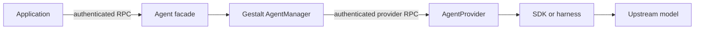
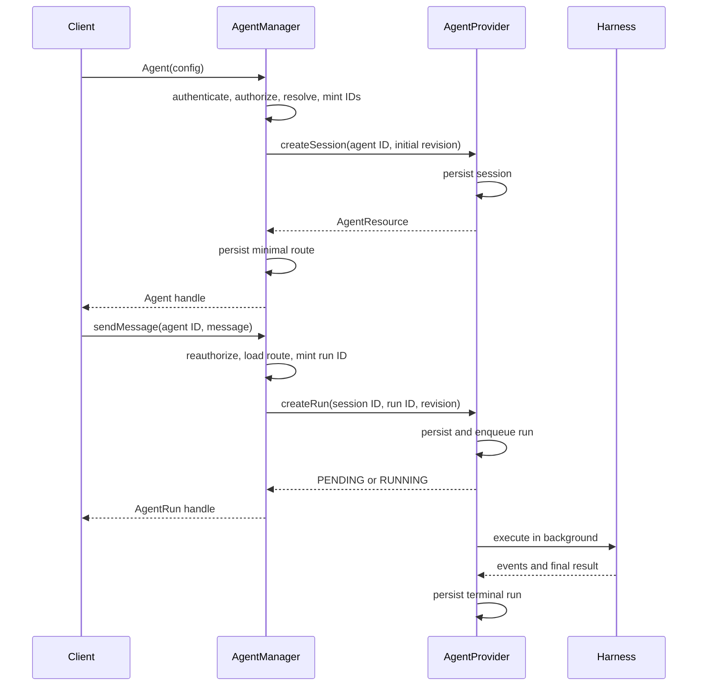

# AgentProvider redesign

> **Status: proposed core decisions.** This document is the first, intentionally
> small design slice. It defines the public lifecycle and ownership boundary.
> Follow-up design changes will specify configuration revisions, tools and
> skills, events and interactions, HTTP transport, retention, and conformance.

## Why this redesign

The current alpha API exposes provider-oriented session and turn operations to
callers. That is useful for infrastructure, but it makes an application manage
provider names, sessions, turns, and recovery details directly.

The target design gives application developers one durable conversation handle:

```ts
const agent = await Agent({
  providerName: "openai-production",
  model: "gpt-5.5",
  instructions: "Fix failing tests.",
});

const run = await agent.sendMessage("Fix the test");
const result = await run.result;

// A later process can reconnect using the durable ID.
const resumed = await Agent({ id: agent.id });
```

The simple client API does not remove sessions and runs from the system. It
hides their CRUD details behind an `Agent` facade while Gestalt and the selected
provider continue to use explicit durable resources.

## Core terms

| Term | Meaning |
| --- | --- |
| `Agent` | A local SDK handle for one durable conversation. |
| Session | The provider-owned durable conversation record behind an `Agent`. |
| Run | One durable execution of one user message in that conversation. |
| `AgentRun` | A local SDK handle used to observe or control one run. |
| `AgentRunResource` | The durable provider record for a run. |
| `AgentManager` | Gestalt's trusted control-plane component. It authenticates, authorizes, resolves, and routes requests. |
| `AgentProvider` | A remote runtime adapter that persists lifecycle state and executes an agent through an SDK, harness, or model loop. |

An agent ID and its provider session ID are the same opaque durable identifier.
The ID identifies a conversation but is not a credential.

## Responsibility boundary



Gestalt and the provider have deliberately different responsibilities:

| Gestalt / AgentManager owns | AgentProvider owns |
| --- | --- |
| Caller authentication and authorization | Canonical durable session |
| Provider selection and routing | Conversation history |
| Stable agent and run IDs | Configuration revision contents |
| Tool, skill, and workspace resolution | Runs, events, interactions, and results |
| Delegated tool authority | Provider-native state and model execution |
| Minimal route and authority record | Cancellation and runtime recovery |
| Portable response validation and errors | Mapping to the selected SDK or harness |

Gestalt stores only what it needs to safely route and reauthorize later calls:
the agent ID, owner and tenant, selected provider, lifecycle visibility, current
configuration revision pointer, and scoped authority references. It does not
duplicate provider-owned conversation history or results.

The provider must serve lifecycle reads without requiring the original model
worker, sandbox, pod, tunnel, or client connection to still exist.

## Public `Agent` facade

```ts
interface Agent {
  /** Opaque durable conversation ID. It does not grant access by itself. */
  readonly id: string;

  /** Current immutable configuration revision. */
  readonly configRevision: string;

  sendMessage(
    message: string,
    options?: AgentSendMessageOptions,
  ): Promise<AgentRun>;

  /** Reconstruct a handle for an existing run after disconnection. */
  getRun(runId: string): Promise<AgentRun>;

  /** Atomically create the next configuration revision. */
  updateConfig(update: AgentConfigUpdate): Promise<AgentConfigRevision>;
}

interface AgentCreateInput {
  /** Optional routing key for a configured AgentProvider. */
  providerName?: string;

  /** Optional provider-supported model override. */
  model?: string;

  instructions?: string;
  tools?: AgentToolSelection;
  skills?: AgentSkillSelection;
  workspace?: AgentWorkspace;
  idempotencyKey?: string;
}

type AgentInit = AgentCreateInput | { id: string };

declare function Agent(input: AgentInit): Promise<Agent>;
```

`Agent(config)` creates the initial provider session before returning the local
handle. Expensive model workers and workspace materialization may remain lazy
until the first message.

`Agent({ id })` does not create a new conversation. Gestalt reauthenticates the
caller, checks access to the stored route, fetches the provider-owned session,
and returns a new local handle for it.

The public API does not expose separate `createSession`, `resumeSession`, or
`listSessions` methods for normal conversation use. Administrative APIs may
still expose authorized session lists.

## `sendMessage` and idempotency

`sendMessage` accepts a string and always authors a user message. Callers cannot
use it to impersonate an assistant, system instruction, or tool result.

```ts
interface AgentSendMessageOptions {
  /**
   * Stable retry key. The SDK generates one when it is omitted.
   * Callers override it when a retry must cross a process boundary.
   */
  idempotencyKey?: string;
}
```

The common operation remains:

```ts
const run = await agent.sendMessage("Fix the test");
```

The options object contains delivery behavior, not agent configuration. Model,
instructions, tools, skills, workspace, and authorization cannot be overridden
for an individual message.

Before the first create attempt, an SDK generates an idempotency key and reuses
it for automatic retries. Reusing the same agent, key, and message returns the
same run. Reusing the key with a different message returns `CONFLICT`.

The explicit option is needed when a job queue, HTTP handler, or new SDK process
must safely retry a request after losing the original response.

## `AgentRun`

Each successful `sendMessage` creates one durable run and returns a local handle
for it:

```ts
interface AgentRun extends AsyncIterable<AgentRunEvent> {
  readonly id: string;

  /** Most recently observed local snapshot. */
  readonly status: AgentRunStatus;

  /** Resolves on success and rejects when the run fails or is canceled. */
  readonly result: Promise<AgentResult>;

  cancel(reason?: string): Promise<void>;
}
```

The run does not store the conversation. The provider-owned session stores
conversation state; the durable run records one execution against that state
and one immutable configuration revision.

An `Agent` has many historical runs, normally one per message. V1 allows at most
one nonterminal run (`PENDING`, `RUNNING`, or `WAITING_FOR_INPUT`) for an agent.
A concurrent `sendMessage` returns `CONFLICT`. Independent parallel work uses
separate agents until the contract defines explicit branching semantics.

A caller can use a run in four ways:

```ts
const run = await agent.sendMessage("Fix the test");

// Wait only for the final successful answer.
const result = await run.result;

// Or render progress as it arrives.
for await (const event of run) {
  render(event);
}

// Control the durable execution.
await run.cancel("No longer needed");

// Recover it in a later process.
const recovered = await resumed.getRun(run.id);
```

A request or stream deadline only stops that client from waiting. It does not
cancel the durable run.

## AgentManager boundary

`AgentManager` is a Gestalt server component, not a public SDK class and not a
model loop. Its input is an authenticated principal plus a typed public request.
Its output is a normalized public resource or portable error.

Every operation follows the same pattern:

```text
public request + authenticated principal
  -> validate and authorize
  -> load or create the agent route
  -> resolve provider, configuration, and authority
  -> mint stable resource IDs and trusted request context
  -> call the selected AgentProvider
  -> validate and normalize the provider response
  -> return a public resource or portable error
```

The HTTP or RPC authentication layer supplies the principal separately from the
request body. Public callers cannot provide `RequestContext`. AgentManager
constructs trusted provider context from authenticated identity, tenant, request
provenance, agent ID, run ID, provider, and configuration revision.

Authorization occurs at creation and again for every later read or mutation,
including resume, run recovery, event replay, and cancellation.

Two representative transformations are:

| Operation | Public input | AgentManager adds | Provider call | Public output |
| --- | --- | --- | --- | --- |
| Create agent | Config selectors and retry key | Principal, provider, capabilities, resolved config, agent ID, revision ID, trusted context | `createSession` | `AgentResource` |
| Create run | Agent ID, user message, retry key | Ownership check, current revision, run ID, execution and authority references, trusted context | `createRun` | `AgentRunResource` |

AgentManager does not execute the model or become canonical for provider-owned
conversation state.

## Network lifecycle

There are two independent network boundaries:

1. The client SDK calls Gestalt's authenticated agent service.
2. AgentManager calls the selected remote AgentProvider using authenticated
   service identity and scoped delegated context.



The provider creation RPC returns after the run is durable, not after model
completion. The model loop continues in a background worker.

## Decisions in this slice

- One public `Agent` represents one durable conversation.
- Creating an `Agent` creates its initial provider session.
- `Agent({ id })` resumes after reauthorization; the ID is not a credential.
- `sendMessage(string)` creates one durable asynchronous run.
- SDKs generate idempotency keys; callers may override them for cross-process
  retries.
- An agent has many historical runs and at most one nonterminal run.
- AgentManager owns authentication, authorization, resolution, routing, IDs,
  trusted context, and response validation.
- AgentProvider owns canonical conversation and execution lifecycle state.
- Client-to-Gestalt and Gestalt-to-provider calls are separate authenticated
  network boundaries.

## Deliberately deferred

Follow-up design PRs will define:

- full configuration revision and compare-and-swap semantics;
- tool, skill, workspace, and delegated-authority resolution;
- event schemas, replay cursors, retention, and payload references;
- approval and input interaction schemas;
- the complete provider RPC surface and capability negotiation;
- HTTP and Server-Sent Events mappings;
- history truncation and summarization policy;
- portable error details and protocol versioning;
- conformance requirements and alpha cutover.
