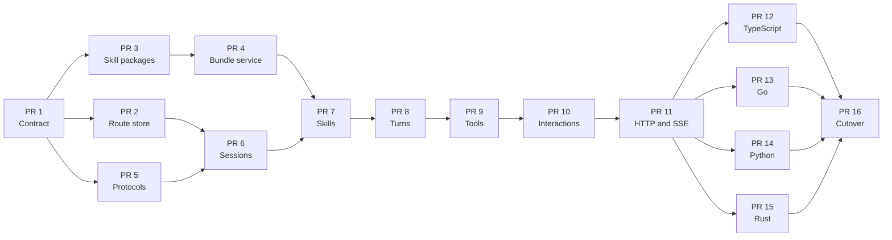

# AgentProvider implementation plan

> **Status: implementation roadmap.** The
> [AgentProvider interface redesign](./agent-provider-design.md) is the source
> of truth for the target API. This document records sequencing, dependencies,
> and acceptance gates; it does not define a second interface.

## Goal

Deliver a complete, implementable AgentProvider contract and the Gestalt
control-plane and SDK surfaces around it. At the end of this plan, provider
authors can implement one stable protocol and validate it with a shared
conformance suite. Implementing production Claude, OpenAI, Codex, or other
vendor providers is follow-up work.

## Locked architecture decisions

- Clients use a stateful `Agent` facade. `Agent(config)` creates a durable
  conversation and `Agent({ id })` resumes one after reauthorization.
- The common client operation is `sendMessage(message: string, options?)`.
  Configuration such as model, instructions, tools, and skills is held by the
  agent rather than repeated with every message.
- Workspace is an optional, capability-gated, creation-only coding extension.
  Gestalt validates logical checkout input and resolves it to an opaque
  provider materialization handle, preferably lazily on the first message.
- The public API has no arbitrary caller metadata bag. Internal routing,
  lifecycle, provider state, and authority use typed fields.
- A provider owns the canonical durable session, configuration revisions,
  turns, ordered events, interactions, results, and provider-native execution
  state.
- Gestalt owns caller authentication and authorization, provider routing,
  tool and skill resolution, workspace validation, and delegated tool
  authority. It persists only the routing and authority records required to
  locate and safely invoke the provider.
- The opaque agent ID is sufficient to route a later request. Gestalt keeps a
  route index from agent ID to provider and owner; the ID is never treated as
  a credential. `clientRef` is not a second conversation identifier.
- Agent-to-Gestalt and Gestalt-to-provider calls are both network boundaries.
  Requests therefore carry stable IDs, idempotency keys, protocol versions,
  deadlines, and authenticated context rather than in-process objects.
- Session configuration is immutable and revisioned. Updates use compare and
  swap; a running turn keeps its captured revision and updates affect only
  later turns.
- Skills use the existing Gestalt package system with `kind: skill`. Gestalt
  resolves logical references to immutable versions and exposes their contents
  to an authorized provider through a digest-backed bundle service. Skills
  contain instructions and resources but never grant tool authority.
- The mandatory provider core is durable sessions, configuration revisions,
  turns, ordered event replay, terminal results, cancellation, and capability
  discovery. Tools, skills, interactions, structured output, workspaces, and
  other extensions are capability-gated.
- Human interaction has two protocol kinds: `approval` and `input`.
  Clarification is text input. A waiting turn resumes after an idempotent
  resolution; it does not create a new turn.
- Providers choose their history truncation and summarization implementation.
  The contract records the selected policy and emits compaction events without
  standardizing one summarization algorithm.
- Portable events persist lifecycle data and redacted summaries. Raw tool
  arguments, tool results, and other sensitive payloads are retained only
  through access-controlled references according to retention policy.
- The public facade ships in TypeScript, Go, Python, and Rust.
- This is an alpha contract, so the final cutover is a clean break. Temporary
  coexistence during development is scaffolding, not a supported compatibility
  promise.

## Target public and provider surfaces

The client experience remains intentionally small:

```ts
const agent = await Agent({
  model: "gpt-5.5",
  instructions: "Fix failing tests.",
  tools: { /* selectors */ },
  skills: { /* package references */ },
});

const run = await agent.sendMessage("Fix the test");
for await (const event of run) {
  // Render progress or handle interaction_requested.
}
const result = await run.result;

// A later process can reconnect using the durable ID.
const resumed = await Agent({ id: agent.id });
```

Underneath that facade:

- `AgentService` is the authenticated Gestalt control-plane API used by public
  clients and SDKs.
- `AgentProvider` is the authenticated runtime protocol implemented by a
  provider.
- Both APIs retain explicit session, turn, event, interaction, and
  configuration resources even though the common SDK hides that CRUD surface.
- Provider capability discovery distinguishes the mandatory lifecycle core
  from optional features before Gestalt routes or resolves a request.

## Pull request sequence

### Phase 1: contract and foundations

#### PR 1 — Finalize the architecture contract

Reconcile the design draft with the locked ownership model and make it
decision-complete. Define the public facade, control-plane/provider boundary,
network trust boundaries, resource state machines, mandatory versus optional
capabilities, configuration revision rules, event retention, interaction
recovery, idempotency, error semantics, and protocol versioning.

**Depends on:** nothing.

**Acceptance:** the design contains no open questions or conflicting ownership
statements, and an SDK or provider implementer can derive every required
lifecycle operation from it.

#### PR 2 — Add the durable Gestalt routing and authority store

Persist the minimum Gestalt-owned records: agent ID, owner and tenant,
provider route, lifecycle visibility, current configuration revision pointer,
and durable authority references. Support create, lookup, ownership checks,
archive or expiry, and idempotent creation. Do not duplicate provider-owned
conversation history, events, results, or interactions.

**Depends on:** PR 1.

**Acceptance:** an agent ID routes correctly after a Gestalt restart; another
caller cannot learn or invoke the route; replaying an idempotent create returns
the same record.

#### PR 3 — Add `kind: skill` packages and installed aliases

Extend the package manifest, validation, catalog, installation, and resolution
paths for skill packages. Allow an installed alias to resolve a logical
marketplace/package/skill reference to an immutable package version and digest.
Keep skill discovery separate from tool authorization.

**Depends on:** PR 1.

**Acceptance:** valid skill packages can be published, installed, aliased, and
resolved deterministically; invalid manifests and unauthorized references fail
before provider execution.

#### PR 4 — Add the authenticated skill-bundle service

Expose immutable skill package contents by digest to authorized provider
principals. Bind access to the resolved agent configuration, verify the digest,
prevent host-path injection, and emit audit records. Define cache behavior
without making a cached artifact a source of authority.

**Depends on:** PR 3.

**Acceptance:** an authorized provider can materialize the exact resolved
bundle; mismatched digests, unrelated providers, expired authority, and
arbitrary filesystem requests are rejected.

#### PR 5 — Introduce the new protobuf protocols additively

Add the new `AgentService` control-plane contract and `AgentProvider` runtime
contract beside the existing alpha `Agent` service. Define stable resource
types, request IDs and idempotency keys, configuration revisions, pagination
cursors, ordered event cursors, interactions, capability discovery, and
portable error details. Generate Go, TypeScript, Python, and Rust bindings in a
separate commit within the PR.

**Depends on:** PR 1.

**Acceptance:** all generated bindings compile; wire-level tests cover enum and
field stability, pagination, event ordering, and representative error details;
the existing path remains unchanged.

### Phase 2: Gestalt control plane and durable lifecycle

#### PR 6 — Implement sessions, routing, and configuration revisions

Implement agent creation and ID-only resume through `AgentService`. Authorize
the caller, select and validate provider capabilities, allocate Gestalt-owned
IDs, create the provider session idempotently, persist the route, and support
compare-and-swap configuration updates. Validate any creation-only workspace
and arrange lazy materialization for capable providers. Recover safely from
failures between the provider call and route-store commit.

**Depends on:** PRs 2 and 5.

**Acceptance:** create, resume, archive/expiry, retry, ownership denial,
provider unavailability, and concurrent update tests pass across process
restarts; stale revisions return a conflict without modifying configuration.

#### PR 7 — Resolve and snapshot skills into configuration

Resolve requested skill aliases during creation or configuration update,
authorize access, capture immutable package versions and digests, and send only
materialization handles to capable providers. Record the resolved set in the
new configuration revision; active turns retain their previous revision.

**Depends on:** PRs 4 and 6.

**Acceptance:** skill add, remove, replace, stale-revision conflict,
unauthorized skill, missing package, and active-turn isolation tests pass.

#### PR 8 — Implement durable turns, results, events, and cancellation

Create turns idempotently, snapshot their configuration revision, and return
without waiting for model completion. Add provider-backed reads, ordered event
replay by cursor, terminal result retrieval, cancellation, and recovery after
worker, provider, or client disconnection. Client wait timeouts must not cancel
the durable turn.

**Depends on:** PR 7.

**Acceptance:** a conformance provider proves asynchronous start, monotonic
events, replay without gaps or duplicates, terminal-state immutability,
idempotent cancellation, and reads after worker and Gestalt restarts.

#### PR 9 — Add resolved tools and durable turn authority

Resolve tool selectors through Gestalt, snapshot the authorized operations in
the configuration revision, and mint least-privilege turn authority for
provider callbacks. Reauthorize each tool invocation against the original
caller, active turn, provider, operation, connection, and credential mode.
Never accept identity or expanded tool scope from model-generated arguments.

**Depends on:** PR 8.

**Acceptance:** allowed invocations preserve caller provenance; cross-turn,
cross-provider, expired, replayed, and out-of-scope invocations fail; skill
selection alone cannot make a tool callable.

#### PR 10 — Add typed interactions and reconnect recovery

Implement durable `approval` and `input` interactions, the
`interaction_requested` event, waiting state, unresolved-interaction listing,
and idempotent resolution. Reauthorize both reads and resolutions. Identical
resolution retries succeed; conflicting resolutions return a conflict.

**Depends on:** PR 9.

**Acceptance:** live stream and disconnected-client tests both detect, resolve,
and resume the same turn; unauthorized and conflicting responses cannot resume
execution.

### Phase 3: HTTP and public SDK facades

#### PR 11 — Add the agent-oriented HTTP API and SSE

Expose `/api/v1/agents` with nested runs, events, and interactions. Map
`Idempotency-Key` to mutation idempotency, `If-Match` to configuration
compare-and-swap, opaque cursors to list and event replay, and Server-Sent
Events to the same durable event log used by polling. Reconnection begins
after the last acknowledged event and never controls turn lifetime.

**Depends on:** PR 10.

**Acceptance:** a stateless HTTP client can create, resume, update, send a
message, stream and replay events, recover pending interactions, resolve them,
obtain a terminal result, and cancel a run without provider-specific knowledge.

#### PR 12 — Add the TypeScript `Agent` facade

Implement `Agent(config)` and `Agent({ id })`, `agent.id`,
`sendMessage(string, options?)`, atomic `updateConfig`, async-iterable
`AgentRun`, `getRun`, `result`, `cancel`, pending-interaction listing, and
`respond`. Add optional convenience setters only as thin `updateConfig`
wrappers.

**Depends on:** PR 11.

**Acceptance:** browser and Node tests cover creation, resume, event streaming,
reconnect, cancellation, interactions, configuration conflicts, and typed
capability errors.

#### PR 13 — Add the Go `Agent` facade

Provide the same creation, run recovery, and interaction semantics using
idiomatic Go contexts, iterators or channels, and explicit run/result handles.
A canceled client context stops waiting but does not cancel a durable run
unless the caller invokes `Cancel`.

**Depends on:** PR 11.

**Acceptance:** the shared SDK conformance scenarios and Go race tests pass.

#### PR 14 — Add the Python `Agent` facade

Provide synchronous or asynchronous entry points consistent with existing
Python SDK conventions while preserving the same durable run recovery, replay,
interaction, and cancellation semantics.

**Depends on:** PR 11.

**Acceptance:** the shared SDK conformance scenarios pass for creation, resume,
iteration, reconnect, configuration conflicts, interactions, and cancellation.

#### PR 15 — Add the Rust `Agent` facade

Provide idiomatic async construction, run recovery, a `Stream`-compatible run,
result awaiting, cancellation, pending-interaction listing, interaction
resolution, and typed errors without exposing provider protocol details.

**Depends on:** PR 11.

**Acceptance:** the shared SDK conformance scenarios and compile-time public
API examples pass.

### Phase 4: alpha cutover

#### PR 16 — Atomically replace the old alpha contract

Switch all internal consumers and documentation to the new path. Remove the old
`Agent` protobuf service, old HTTP routes and SDK CRUD clients, `clientRef`,
public role-bearing message inputs, and provider-minted public IDs. Reserve
removed protobuf field numbers and names, bump the provider protocol version,
and delete temporary adapters only after every supported SDK passes
conformance.

**Depends on:** PRs 12, 13, 14, and 15.

**Acceptance:** repository-wide searches find no supported old surface; all
builds and conformance suites pass from a clean checkout; a provider author can
implement the new contract without depending on Gestalt internals.

## Dependency graph



## Phase acceptance gates

### Phase 1 complete

- The architecture document is decision-complete and matches the locked
  ownership boundary.
- Routing survives restart without duplicating provider lifecycle state.
- Skill references resolve to immutable, authorized artifacts.
- Both new protocols generate and compile in all four supported languages.
- No production behavior has switched to the new path.

### Phase 2 complete

- A conformance provider supports the mandatory lifecycle across restarts and
  network failures.
- Configuration, skills, and tools are immutable per turn and update by
  compare-and-swap for later turns.
- Events, terminal results, cancellation, and interactions are durable and
  recoverable without a live stream.
- Every provider callback is bound to the original caller and least-privilege
  turn authority.

### Phase 3 complete

- A stateless HTTP client can exercise the entire lifecycle using only durable
  IDs, cursors, and authenticated requests.
- SSE and polling observe the same ordered event log.
- TypeScript, Go, Python, and Rust expose equivalent behavior through idiomatic
  facades and pass a shared conformance matrix.

### Phase 4 complete

- The new interface is the only supported alpha surface.
- Removed protobuf identifiers are reserved and cannot be accidentally reused.
- Documentation, examples, internal callers, generated code, and tests all use
  the new contract.
- The conformance suite is the release gate for future provider
  implementations.

## Merge and cutover strategy

- Merge PR 1 first. PRs 2, 3, and 5 may then proceed in parallel; PR 4 follows
  PR 3.
- Merge PRs 6 through 11 in dependency order because each establishes the
  durable semantics required by the next.
- Develop PRs 12 through 15 in parallel after the HTTP contract is stable.
- Target each PR at `main` after its dependencies merge instead of maintaining
  one long-lived sixteen-PR stack.
- Keep new RPCs and HTTP routes non-default until PR 16. Temporary adapters may
  exist only to unblock incremental development and are removed during
  cutover.
- Keep generated protobuf changes in a distinct commit within PR 5 so schema
  review remains readable.
- Use a deterministic in-repo conformance provider through Phases 2 and 3.
  Production vendor provider implementations begin only after the contract
  passes cutover.
- Do not include local binaries or unrelated worktree changes in any PR.

## Definition of done

This roadmap is complete when:

1. The design document, protobuf contracts, HTTP API, and four SDKs describe
   one consistent lifecycle and responsibility boundary.
2. Agent creation, ID-only resume, configuration updates, turns, event replay,
   results, cancellation, tool calls, and human interactions work after client,
   Gestalt, worker, and provider reconnection.
3. Authorization is rechecked at every external entry point; durable IDs,
   skills, model output, and cached bundles never act as credentials.
4. Configuration and authority are revisioned and auditable, with active turns
   isolated from later changes.
5. Mandatory and optional provider capabilities are explicit, versioned, and
   exercised by conformance tests.
6. Provider authors have a stable generated interface, lifecycle documentation,
   a reference conformance provider, and a test suite they can run before
   integrating with Gestalt.
7. The old alpha surface is removed and cannot silently reappear through stale
   generated code or documentation.
