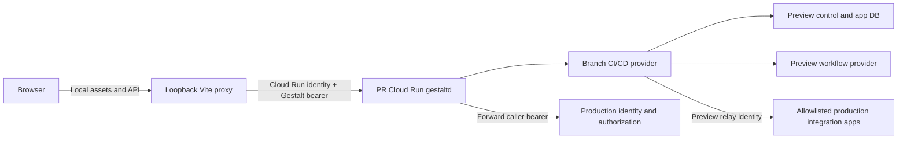

# Gestalt App Preview Environments

## Status

Proposed. This plan defines a reusable preview-environment foundation and a
`valon-tools/apps/ci-cd` pilot. It does not authorize implementation or production
rollout by itself.

## Overview

Gestalt app authors can run a frontend locally with hot module replacement, but
backend changes that need production integrations, authorization, or workflows are
still difficult to verify without deploying the app to production. CI/CD is the
first pilot because its pages depend on correlated GitHub, Linear, workqueue, and
deployment data, and because its merge-readiness feature needs real caller
authorization.

The proposed development loop is:

1. An internal pull request publishes an immutable app snapshot for its exact commit.
2. Trusted automation creates or updates a dedicated preview `gestaltd` service.
3. The branch app provider runs in that preview with isolated application and workflow
   storage.
4. A loopback-only Vite proxy sends local browser API requests to the preview.
5. The preview validates the developer's real Gestalt bearer and delegates only an
   explicit set of integration reads through a least-privilege preview identity.
6. App workflows are installed paused and may be run manually.
7. Closing or expiring the pull request deletes all preview resources.

This is deliberately a separate control plane. A preview must not be a no-traffic
revision of the production `toolshed-test` Cloud Run service, a production app-registry
candidate, or a reverse-published provider that shadows a production app.

## Goals

- Run a branch version of a Gestalt app backend remotely without changing production
  traffic or provider selection.
- Keep frontend source and HMR local.
- Exercise real caller authentication and authorization, including CI/CD's admin-only
  `pullRequests.mergeReadiness`.
- Let developers materialize one or two representative records and inspect workflow
  inputs, intermediate values, outputs, and logs.
- Install app-declared workflows without allowing schedules or event activations to
  run automatically.
- Reuse the same preview deployment contract for other Gestalt apps after the CI/CD
  pilot.
- Make preview creation, update, attachment, reset, and teardown deterministic enough
  for agents to execute and verify.

## Non-goals

- Sending production traffic to preview code.
- Testing production migrations, production writes, merge-queue mutations,
  notifications, or fast-track actions.
- Cloning the production Gestalt control-plane database.
- Sharing production Temporal state or task queues.
- Making reverse provider publication subject-aware as part of this pilot.
- Supporting untrusted fork pull requests automatically.
- Adding broad localhost CORS support to Gestalt.
- Providing indefinite preview persistence.
- Replacing normal unit, contract, and integration tests.

## Current State

### Local UI to remote API already works

The CI/CD app's
`valon-tools/apps/ci-cd/scripts/dev-ui-remote.sh` starts Vite on loopback, obtains a
Gestalt API token, and sets `GESTALT_API_PROXY_TARGET`. The Gestalt Vite plugin in
`sdk/typescript-web/src/vite.js` proxies `/api/v1` and `/api/v2`, adding the bearer
server-side so it is not exposed to frontend JavaScript.

The missing piece is a safe branch backend URL. Today the script points at
`https://valon.tools`, so it can validate local UI changes only against the already
deployed provider.

### Branch snapshots can already be built

Toolshed's `.github/workflows/publish-app-snapshot.yml` accepts an app and arbitrary
branch, tag, or SHA. It packages immutable
`0.0.0-snapshot.g<full-commit-sha>` artifacts. The workflow currently packages branch
code and later authenticates to GCP in the same job, which is acceptable for trusted
main-branch publishing but is not an adequate boundary for automated pull-request
previews. Branch-controlled code can leave a process running until credentials are
minted later in the job.

### Gestalt config has most placement primitives

Gestalt supports left-to-right config overlays, named remotes, local and remote
provider placement, source overrides, distinct public and management listeners, and
app-specific IndexedDB bindings. Useful implementation points include:

- `gestaltd/internal/config/config.go`
- `gestaltd/internal/config/remotes.go`
- `gestaltd/internal/config/config_validate.go`
- `gestaltd/internal/daemon/provider_local.go`
- `gestaltd/internal/bootstrap/provider_build.go`

These are building blocks, not a preview-isolation mode. Safe composition remains the
deployment's responsibility.

### Remote authentication is currently static

`gestaltd/internal/remote/remote.go` attaches one configured bearer token to every RPC
on a named remote. Consequently, merely marking production identity and authorization
providers `remote: prod` does **not** preserve the interactive caller: it authenticates
the preview's configured relay token instead.

The preview requires two distinct upstream authentication modes:

- **Caller forwarding** for production identity and authorization, using the bearer
  from the incoming local-UI request.
- **Static preview relay identity** for explicitly allowlisted integration operations.

This must be implemented as an explicit Gestalt remote-auth contract. The preview must
not infer or copy browser cookies, forward arbitrary caller headers, or give branch
code direct access to either token.

### Shared storage is unsafe

Gestalt's config exposes `apps.<name>.indexeddb.db` and `objectStores`, but the current
host-service bootstrap does not provide enough evidence that these fields form a hard
runtime isolation boundary for every provider. Relevant paths are:

- `gestaltd/internal/config/provider_selection.go`
- `gestaltd/internal/bootstrap/host_service_bootstrap.go`
- `gestaltd/services/indexeddb/server.go`
- `gestaltd/internal/bootstrap/executable_app_test.go`

Until provider-backed isolation is enforced and tested end to end, every preview must
receive a separate physical database or a separate provider credential constrained to
one preview schema. A different logical `db` string on a shared privileged provider is
not sufficient.

The same requirement applies to Gestalt core state: users, app installations,
rollouts, authorization fragments, and remote registrations must not share the
production control-plane database.

### Workflow startup mutates provider state

App-declared workflows are read from provider metadata and reconciled at startup by
`gestaltd/internal/bootstrap/workflow_app_definitions.go`. Config-managed definitions
are similarly reconciled by `workflow_config_definitions.go`. Reconciliation applies
definitions and removes absent managed definitions. A preview connected to production
Temporal could update, pause, activate, or delete production workflow state before any
HTTP request reaches it.

Definitions and activations already have paused flags, but deployment config cannot
currently force app-declared workflows paused before their first reconciliation.
Pausing after startup leaves a race with the first scheduled tick.

### Reverse publication is not a preview boundary

Reverse-published providers are resolved globally by kind and app name. A registered
`app/ci-cd` takes precedence over the production provider for all callers; provider
ownership is also global. Making this subject-aware would touch registration storage,
provider resolution, app catalogs, mounted UI routing, workflows, auditing, fallback,
and authorization. It is larger and riskier than a dedicated preview service and does
not naturally solve storage isolation.

## Desired End State

An approved internal CI/CD pull request receives a URL such as:

```text
https://gestalt-preview-ci-cd-pr-123-<hash>.run.app
```

From a Toolshed checkout, a developer runs:

```bash
./valon-tools/apps/ci-cd/scripts/dev-ui-preview.sh 123
```

The command:

1. Resolves the preview for PR 123 and verifies its commit.
2. Obtains the developer's Gestalt token without exposing it to the browser.
3. Obtains and refreshes Cloud Run invocation identity.
4. Starts Vite on `127.0.0.1`.
5. Proxies API calls to the preview with independent Cloud Run and Gestalt
   authorization headers.
6. Prints commands for materializing a PR, starting a workflow manually, viewing its
   JSON output, and opening logs.

The preview persists its isolated database across branch-provider updates. A reset
action destroys and recreates only that preview's data. It is removed on PR close and
also by a hard-lifetime sweeper.

## Architecture



### Request identities

There are three identities and they must remain separate:

1. **Cloud Run invoker** proves that the local proxy may reach the preview service. It
   is carried in `X-Serverless-Authorization`.
2. **Interactive Gestalt caller** is the developer's existing Gestalt bearer in
   `Authorization`. Production identity validates it, and production authorization
   evaluates that caller's relationships. This is what makes admin and non-admin
   merge-readiness behavior realistic.
3. **Preview integration relay** is a dedicated non-human Gestalt principal used only
   for the named remote apps and operations allowed by the preview manifest. It is not
   `service_account:ci-cd-sync` and has no mutation authority.

Gestalt never passes the interactive caller bearer to branch provider code. Gestalt
mediates host-service and remote app calls.

### Branch-code trust boundary

An internal PR provider is still arbitrary code running beside `gestaltd`. The current
local-provider process model is not a hardened sandbox, so the pilot must assume that a
compromised provider can exercise the preview runtime identity and any static relay
authority available to the process. Secret non-exposure alone is not the security
boundary.

Therefore the runtime identity grants only preview resource access, and the relay
grants only operations whose production read results are acceptable for the approved
internal PR author to see. The relay has no write, impersonation, token-minting,
secret-reading, or broader discovery authority. Forks remain ineligible. Stronger
subprocess/container isolation can reduce this trust later, but it is not a prerequisite
for a read-only internal pilot and must not be implied by this plan.

### Provider placement

The generated final overlay for a CI/CD preview uses:

- Local branch `ci-cd` app provider.
- Local preview IndexedDB provider backed by preview-constrained credentials.
- Local preview workflow provider and workflow storage.
- Caller-forwarding remote for identity and authorization.
- Static-relay remote for an exact set of GitHub, Linear, Valon Profile, Datadog, and
  Valkey operations.
- No remote IndexedDB or workflow provider.
- No production registry reconciliation.

Dependencies that cannot operate with the preview relay's least-privilege grants are
excluded from the pilot. Automatic schedules remain blocked; lack of an integration
may produce an explicit partial result but must not silently fall back to a production
service account.

### Network surface

- Cloud Run requires IAM invocation.
- The public listener exposes app and normal public API routes only.
- The management listener binds to loopback and is not mapped by Cloud Run.
- `/activate`, `/admin`, and management metrics are not externally reachable.
- Vite binds to `127.0.0.1`, validates the browser origin, and keeps both credentials
  server-side.
- No preview adds permissive CORS headers to production or Gestalt.

## Safety Invariants

The implementation is incomplete until all invariants are mechanically enforced or
tested:

1. Preview automation never updates the production `toolshed-test` Cloud Run service,
   revision tags, traffic, or config.
2. Every preview has a unique service, datastore credential, encryption key, runtime
   identity, resource labels, and expiry.
3. Preview control-plane, app, and workflow state cannot address production storage.
4. Branch-controlled code never executes in a job after GCP publication or deployment
   credentials are minted.
5. Preview artifacts are selected by full commit SHA and verified digest, never a
   mutable branch name.
6. Only internal pull requests or explicitly approved commits can receive previews.
7. `server.authorizationStateApply` is false and the environment override is unset.
8. The developer's bearer is forwarded only to the configured identity/authorization
   remote over HTTPS.
9. Integration calls use a separate least-privilege relay and exact app-operation
   allowlists.
10. The production `ci-cd-sync` token, production database DSN, and production Temporal
    credentials are never available to branch code.
11. App-declared workflow definitions and activations are forced paused before their
    first reconciliation.
12. Management routes are private to the container.
13. Production app-registry activation, rollout evaluation, and authorization-state
    writes are disabled.
14. Preview config, IAM, secret bindings, placement, and egress are trusted inputs;
    a pull request cannot replace them.
15. Preview services, databases, credentials, keys, and secrets are deleted on close
    and by a maximum-age sweeper.
16. Resources and logs carry repository, app, PR, owner, source SHA, workflow run, and
    expiry labels.

## Implementation Approach

Deliver the capability in six phases. Phases 1 and 2 establish reusable Gestalt and
publication safety. Phase 3 creates one manually triggered CI/CD preview. Phases 4 and
5 provide the useful developer loop and lifecycle automation. Phase 6 generalizes only
the parts proven by the pilot.

## Phase 1: Gestalt Preview Safety Primitives

### 1. Caller-forwarding named remote authentication

**Files**

- `gestaltd/internal/config/remotes.go`
- `gestaltd/internal/config/config_validate.go`
- `gestaltd/internal/remote/remote.go`
- `gestaltd/internal/remote/remote_test.go`
- Request authentication/context plumbing under `gestaltd/internal/server/`
- `gestaltd/internal/bootstrap/bootstrap.go`
- `docs/content/reference/config-file.mdx`

**Changes**

Replace the implicit token-only remote contract with a backward-compatible explicit
auth shape. Existing `token` continues to mean a static bearer. Add a mode that forwards
the incoming bearer from trusted request context:

```yaml
server:
  remotes:
    caller-auth:
      url: https://valon.tools
      auth:
        mode: forwardBearer
```

Validation must:

- Reject `forwardBearer` with a static token.
- Require HTTPS except for loopback tests.
- Allow the mode only when the remote is referenced by explicitly supported provider
  kinds.
- Never forward cookies or arbitrary authorization-like headers.
- Fail unauthenticated background calls instead of falling back to another identity.
- Redact bearer values from logs and errors.

The HTTP/gRPC request boundary must capture the raw bearer into a private context value
before remote identity resolution. Public gRPC must continue stripping caller-supplied
trusted-principal metadata. Remote interceptors read only the private context value.

Use one caller-forwarding remote for identity and authorization and a second
static-token remote for dependency apps. Do not make all remotes inherit one auth mode.

### 2. Force-pause app-declared workflows

**Files**

- `gestaltd/internal/config/config.go`
- `gestaltd/internal/config/config_validate.go`
- `gestaltd/internal/bootstrap/workflow_app_definitions.go`
- `gestaltd/internal/bootstrap/workflow_app_definitions_test.go`
- `gestaltd/internal/bootstrap/workflow_startup_test.go`
- `docs/content/reference/config-file.mdx`
- `docs/content/applications.mdx`

**Changes**

Add deployment policy on an app binding:

```yaml
apps:
  ci-cd:
    workflowPolicy:
      forcePaused: true
```

Before app definitions are passed to the workflow provider, force both the definition
and every activation paused. Preserve the app's original schedule and event metadata so
an authorized developer can inspect and deliberately enable a selected activation.
Manual `StartRun` remains available while automatic schedule and event starts remain
blocked.

The policy is deployer-owned and not part of branch package metadata. Apply it during
desired-definition construction, not in a post-start script.

### 3. Dual-auth Vite proxy

**Files**

- `sdk/typescript-web/src/vite.js`
- `sdk/typescript-web/src/vite.d.ts`
- `sdk/typescript-web/tests/vite-plugin.test.ts`
- `sdk/typescript-web/README.md`
- `docs/content/applications.mdx`

**Changes**

Keep the existing Gestalt bearer behavior. Add an optional serverless identity source
that maintains a cached token and sets `X-Serverless-Authorization`. The source should
support an external command or callback, parse JWT expiry, refresh before expiration,
and fail the proxied request closed when refresh fails.

The browser must never receive either token. Preserve any explicit browser
`Authorization` header only under the existing rules; the serverless token always uses
its separate header.

### Phase 1 success criteria

#### Automated verification

- [ ] Remote config rejects conflicting, insecure, or unknown auth modes.
- [ ] Static-token remotes retain existing behavior.
- [ ] Caller-forwarding sends the current request's bearer to remote identity and
      authorization and sends no bearer for a request without one.
- [ ] A concurrent request test proves bearers cannot cross between callers.
- [ ] Logs and returned errors contain no bearer values.
- [ ] App workflow definitions and all activations are paused on their first apply.
- [ ] A manual workflow run can still start under `forcePaused`.
- [ ] No scheduled run starts during a multi-tick integration test.
- [ ] Vite sends independent `Authorization` and `X-Serverless-Authorization` headers
      and refreshes the latter before expiry.

#### Manual verification

- [ ] Two users with different production roles receive different authorization
      decisions through a local preview server.
- [ ] An expired Cloud Run identity produces an actionable proxy error without exposing
      token text.

## Phase 2: Secure Branch Artifact Publication

### Files

- `/Users/michael/valon/toolshed/.github/workflows/publish-app-snapshot.yml`
- `/Users/michael/valon/toolshed/.github/workflows/publish-app-preview.yml` (new)
- `/Users/michael/valon/toolshed/.github/valon-tools-provider-snapshot-publish.yaml`
- `/Users/michael/valon/toolshed/.github/scripts/` preview artifact validation scripts
- Co-located script tests

### Changes

Split the pipeline into trust domains:

1. Ordinary PR CI checks out the exact source SHA, installs frozen dependencies,
   packages the app, and uploads an unprivileged GitHub Actions artifact containing the
   provider archives, catalog/workflow metadata, source SHA, and checksums.
2. A trusted default-branch workflow is triggered only after required CI succeeds. It
   downloads bytes rather than checking out and executing the PR.
3. Trusted code validates app name, commit SHA, archive paths, manifest identity,
   checksums, and package metadata.
4. Only then does it authenticate to GCP and publish the immutable snapshot.

The trusted job must use its own checked-in scripts and Dockerfile from the default
branch. It must not run hooks, shell scripts, package managers, or binaries from the PR
artifact.

### Phase 2 success criteria

#### Automated verification

- [ ] A valid internal PR artifact publishes under its full source SHA.
- [ ] Mismatched app name, SHA, checksum, manifest source, or unexpected archive member
      fails before GCP authentication.
- [ ] Fork PRs cannot enter the trusted publication workflow without explicit approval.
- [ ] The publication is create-only and cannot overwrite an existing version.

#### Manual verification

- [ ] Registry metadata points to the reviewed PR commit and expected artifact digest.
- [ ] Cancelling or retrying a publish is idempotent.

## Phase 3: CI/CD Preview Runtime Pilot

### Trusted preview deployment assets

**Files**

- `/Users/michael/valon/toolshed/valon-tools/deploy/preview/base.yaml` (new)
- `/Users/michael/valon/toolshed/valon-tools/deploy/preview/ci-cd.yaml` (new)
- `/Users/michael/valon/toolshed/valon-tools/deploy/preview/Dockerfile` (new)
- `/Users/michael/valon/toolshed/.github/workflows/deploy-app-preview.yml` (new)
- `/Users/michael/valon/toolshed/.github/scripts/app-preview-deploy.sh` (new)
- `/Users/michael/valon/toolshed/.github/scripts/tests/app-preview-deploy_test.sh` (new)
- `/Users/michael/valon/toolshed/valon-tools/terraform/preview/` (new)

The preview Terraform root is separate from the existing production root and uses its
own state and deploy identity. Production deployment workflows do not plan or apply it.

### Runtime configuration

Create a curated preview base rather than copying production config wholesale.
Generated values include preview ID, source SHA, public URL, datastore credentials,
encryption key secret, relay identity, resource labels, and expiry.

The CI/CD overlay includes:

- The normal CI/CD operation authorization policy and `mergeReadiness` admin rule.
- Branch snapshot selected by immutable version/digest.
- Preview-only IndexedDB and workflow bindings.
- `workflowPolicy.forcePaused: true`.
- `authorizationStateApply: false`.
- Only the dependency apps and operation metadata required for the pilot.
- No mutation operations for Trunk, GitHub, notifications, or fast-track behavior.
- No production Temporal provider or database references.

Deploy one Cloud Run service per PR:

```text
gestalt-preview-ci-cd-pr-<number>
```

Use min instances `0`, max instances `1`, bounded CPU/memory, IAM-only invocation, and
preview-specific runtime identity. A per-PR service makes URL, IAM, logs, and teardown
obvious; consolidation into tagged revisions is deferred until usage proves service
count is a problem.

The deployment workflow never calls production `/activate`, changes production
traffic, or reuses `.github/workflows/deploy-valon-tools.yml`.

### Datastore isolation

Provision a distinct database and credential constrained to that database for each
preview. The runtime identity can read its database credential but has no permission to
enumerate or access production database secrets. Preserve the database when updating a
preview to a newer commit. Reset replaces the preview database and credential as one
fenced operation.

### Integration relay

Create a preview relay subject with only the operations needed for:

- Pull request and check reads from GitHub.
- Deployment workflow/job reads.
- Linear attachment/issue reads.
- Valon Profile reads needed by author display and filtering.
- Optional Datadog and Valkey reads only if their providers can enforce the same
  least-privilege boundary.

Exclude unsupported dependencies from the first pilot. Do not grant the branch
provider the production CI/CD sync subject.

### Phase 3 success criteria

#### Automated verification

- [ ] Preview config validation proves IndexedDB and workflow providers are local and
      production DSNs/Temporal values are absent.
- [ ] Management listener is unreachable from the Cloud Run URL.
- [ ] `/health` and authenticated `/ready` pass before the preview is announced.
- [ ] A known viewer can call normal CI/CD reads.
- [ ] An admin can call `mergeReadiness`; a non-admin receives permission denied.
- [ ] No workflow activation starts automatically.
- [ ] Deployment scripts cannot name or update `toolshed-test`.

#### Manual verification

- [ ] Updating the PR changes provider behavior while retaining preview data.
- [ ] Production CI/CD routing, database rows, workflows, and app revision remain
      unchanged.
- [ ] Preview audit and application logs identify PR, app, owner, and source SHA.

## Phase 4: High-signal CI/CD Data and Workflow Loop

### Explicit preview operation

**Files**

- `/Users/michael/valon/toolshed/valon-tools/apps/ci-cd/provider.ts`
- `/Users/michael/valon/toolshed/valon-tools/apps/ci-cd/sync/` orchestration and source
  modules
- New preview-specific module and tests under the CI/CD app
- `/Users/michael/valon/toolshed/valon-tools/deploy/preview/ci-cd.yaml`
- `/Users/michael/valon/toolshed/valon-tools/deploy/config.yaml`

Add an operation such as:

```text
preview.materializePullRequest({ prNumber })
```

It is registered by the provider but fails closed unless `previewMode` is true.
Production omits it from `allowedOperations`; the preview overlay grants it only to
admins.

The operation:

1. Validates one Front Porch pull request number.
2. Reads the PR, head checks/actions, merge commit deployments, Linear association, and
   other available read-only sources through the preview relay.
3. Runs the same normalization and correlation functions used by scheduled syncs.
4. Writes only to the preview database.
5. Returns structured stage results with timing, source freshness, partial failures,
   persisted keys, and the final pull-request/revision views.
6. Is idempotent for the same PR and source versions.

Do not repurpose `deployments.clearCache` or make fixture JSON part of a production
handler. Keep existing local fixtures useful for offline tests, but make the preview
path explicit and auditable.

### Manual workflow controls

Install normal CI/CD workflow definitions into the preview provider with every
activation paused. Document and script:

- Listing definitions and paused state.
- Starting a selected run manually with input.
- Waiting for terminal status.
- Printing step inputs/outputs as JSON.
- Opening the run inspector and logs.
- Resetting preview data.

Automatic activation remains out of scope for the initial pilot even after manual runs
work.

### Phase 4 success criteria

#### Automated verification

- [ ] The preview operation is denied when `previewMode` is false.
- [ ] Production config does not allowlist the preview operation.
- [ ] One-PR materialization uses bounded API calls and writes only expected preview
      records.
- [ ] Repeating materialization is idempotent.
- [ ] Partial integration failures are explicit and preserve successful stage output.
- [ ] Correlated JSON matches the data returned by list and detail operations.

#### Manual verification

- [ ] A developer can materialize one PR, open its local UI page, and inspect checks,
      deploys, mergeability, and merge requirements without shipping backend code.
- [ ] A developer can start a workflow manually and retrieve useful JSON for an agent
      feedback loop.

## Phase 5: Developer Attachment and Lifecycle Automation

### Local command

**Files**

- `/Users/michael/valon/toolshed/valon-tools/apps/ci-cd/scripts/dev-ui-preview.sh`
  (new)
- `/Users/michael/valon/toolshed/valon-tools/apps/ci-cd/scripts/dev-common.sh`
- `/Users/michael/valon/toolshed/valon-tools/apps/ci-cd/ui/vite.config.ts`
- Vite proxy contract tests
- `/Users/michael/valon/toolshed/valon-tools/apps/ci-cd/knowledge/gestalt/local-development.md`
- `/Users/michael/valon/toolshed/valon-tools/apps/ci-cd/spec.md`

`dev-ui-preview.sh <pr-number>` resolves the preview from a GitHub deployment or Cloud
Run labels, verifies the source SHA is on the PR, resolves stored Gestalt credentials,
starts the refreshable Cloud Run identity source, and launches loopback Vite.

It prints:

- Local application URL.
- Preview PR and source SHA.
- Materialize/reset commands.
- Workflow run and output commands.
- Cloud Logging link.
- Preview expiry.

The script refuses previews whose app, repository, owner, or SHA labels do not match the
requested PR.

### Lifecycle workflows

**Files**

- `/Users/michael/valon/toolshed/.github/workflows/delete-app-preview.yml` (new)
- `/Users/michael/valon/toolshed/.github/workflows/prune-app-previews.yml` (new)
- `/Users/michael/valon/toolshed/.github/scripts/app-preview-cleanup.sh` (new)
- Co-located cleanup tests

Update previews on approved PR commits using concurrency keyed by repository, app, and
PR. Announce readiness through a GitHub deployment and one updated PR comment rather
than a new comment per commit.

Delete on PR close. A scheduled sweeper independently removes previews past hard
lifetime or attached to closed/missing PRs. Cleanup is idempotent and removes service,
database, database user, credentials, encryption secret, and deployment metadata.
Artifact Registry and snapshot retention independently remove old immutable artifacts.

Use a default hard lifetime of 72 hours. An open PR can recreate an expired preview on
its next approved deployment; there is no indefinite keepalive.

### Phase 5 success criteria

#### Automated verification

- [ ] Resource naming and labels are deterministic and injection-safe.
- [ ] New commits supersede older deployments for the same app/PR.
- [ ] Close cleanup and the sweeper select the same resource closure.
- [ ] Repeated cleanup succeeds when resources are already absent.
- [ ] Attachment rejects a mismatched or expired preview.
- [ ] Tokens never appear in shell tracing, process arguments, Vite responses, GitHub
      comments, or logs.

#### Manual verification

- [ ] One command attaches a local UI to the correct preview.
- [ ] Scale-from-zero latency and token refresh produce actionable progress messages.
- [ ] Closing the PR removes all preview resources within the documented window.

## Phase 6: Reusable App Preview Contract

Generalize only after CI/CD completes the manual pilot.

### Changes

- Define a trusted preview manifest describing app name, local provider source,
  dependencies and exact operations, datastore needs, workflow policy, health smoke
  operation, and mutation exclusions.
- Extract app-independent publication, deployment, attachment, and cleanup workflows.
- Keep app-specific materialization/reset operations in each app.
- Add documentation under `docs/content/applications.mdx` describing preview topology,
  credentials, storage, workflows, and the local proxy.
- Provide a validation command that renders the effective config and rejects production
  state references, unpaused workflows, public management listeners, mutable sources,
  or unbounded relay catalogs.

Do not automatically onboard apps that require production writes. They need a
preview-owned downstream resource or explicit dry-run interface first.

### Phase 6 success criteria

#### Automated verification

- [ ] A second non-CI/CD app can deploy using only the reusable workflow plus its
      preview manifest.
- [ ] Effective-config validation catches every safety invariant expressible in config.
- [ ] App-specific scripts cannot override trusted IAM, secrets, placement, or cleanup.

#### Manual verification

- [ ] A developer can discover, deploy, attach, inspect, and delete the second app using
      the same command vocabulary.

## Testing Strategy

### Unit tests

- Remote auth mode parsing, validation, bearer extraction, redaction, and concurrency.
- App workflow force-pause transformation.
- Vite dual-header injection and refresh.
- Artifact provenance and archive validation.
- Preview naming, labels, expiry, and cleanup selection.
- CI/CD preview-mode gate and one-PR orchestration.

### Gestalt integration tests

Run two in-process Gestalt origins:

1. Upstream with identity, authorization, and a test dependency app.
2. Preview with caller-forwarding auth, local app/storage/workflow, and static relay.

Verify distinct callers, role decisions, nested dependency calls, isolated records,
paused activations, manual workflow runs, and bearer non-leakage.

Add a provider-backed IndexedDB test that proves one preview credential cannot read a
second preview or production schema. This is an infrastructure acceptance test, not
only a mock host-service test.

### Toolshed end-to-end test

For a controlled CI/CD test branch:

1. Publish an immutable branch snapshot.
2. Deploy a preview.
3. Attach local Vite.
4. Materialize one PR.
5. Verify list/detail UI data.
6. Verify admin and non-admin merge-readiness behavior.
7. Run one workflow manually and inspect JSON.
8. Update the branch provider and confirm data persists.
9. Reset the preview and confirm only preview data changes.
10. Close the PR and verify complete cleanup.

Before and after the test, capture production Cloud Run traffic/revision, CI/CD app
revision, workflow definitions, and representative database checksums or update
timestamps. They must not change because of the preview.

## Rollout

1. Ship and pin the Gestalt remote-auth, workflow-policy, and Vite changes.
2. Provision preview infrastructure with no app deployment enabled.
3. Run artifact publication security tests.
4. Manually deploy one CI/CD preview for designated maintainers.
5. Validate caller authorization and one-PR materialization.
6. Validate manual workflows while all activations remain paused.
7. Enable opt-in deployment by PR label for internal contributors.
8. Observe cost, startup time, cleanup reliability, integration rate limits, and audit
   volume for at least two weeks.
9. Onboard a second read-oriented app through the reusable manifest.
10. Consider broader self-service only after both pilots satisfy the same invariants.

### Rollback

- Disable the preview deployment workflow and remove its WIF binding.
- Revoke the preview integration relay.
- Delete all resources selected by preview labels.
- Leave branch snapshots to normal retention.
- Gestalt's new config fields remain dormant when unused; static named remotes and
  existing Vite bearer proxying remain backward compatible.

No rollback step touches production application versions because previews never become
production candidates.

## Success Metrics

- An approved CI/CD preview is ready within 10 minutes of a commit.
- Attaching the local UI is one command and less than one minute excluding scale-up.
- UI-only iterations remain immediate through HMR.
- One-PR materialization returns useful JSON and a working page without a production
  deploy.
- At least one backend/auth feature is completed without test-only production PRs.
- Preview cleanup succeeds automatically for every pilot PR, with the sweeper catching
  any missed close event.
- There are zero preview writes to production Gestalt, CI/CD, or workflow state.
- No preview credential appears in branch jobs, browser JavaScript, logs, or comments.

## Work Breakdown and Dependencies

| Work item | Repository | Depends on |
| --- | --- | --- |
| Caller-forwarding remote auth | `gestalt` | — |
| Forced-paused app workflows | `gestalt` | — |
| Dual-auth Vite proxy | `gestalt` | — |
| Trusted branch artifact split | `toolshed` | — |
| Preview infrastructure/config | `toolshed` | Gestalt safety primitives |
| CI/CD materialization operation | `toolshed` | Preview relay contract |
| Local attachment command | `toolshed` | Dual-auth proxy and preview deployment |
| Cleanup/TTL automation | `toolshed` | Preview infrastructure |
| Reusable app manifest | both | Successful CI/CD pilot |

The first three Gestalt changes and the artifact-pipeline split can proceed in parallel.
The preview runtime must not launch until caller authentication, force-pause, and
artifact trust boundaries are deployed.

## Definition of Done

- All safety invariants are enforced by config validation, IAM, provider credentials,
  or automated tests.
- CI/CD's local UI works against a remote branch backend with real caller role checks.
- One-PR data and a manual workflow produce inspectable JSON.
- Production routing and state remain unchanged through the end-to-end test.
- Close and TTL cleanup remove the full preview resource closure.
- Documentation clearly distinguishes preview-local state, delegated production reads,
  and prohibited production writes.
- A second Gestalt app can adopt the reusable foundation without copying CI/CD-specific
  deployment logic.

## References

### Gestalt

- `docs/content/applications.mdx`
- `docs/content/reference/config-file.mdx`
- `gestaltd/internal/config/config.go`
- `gestaltd/internal/config/remotes.go`
- `gestaltd/internal/remote/remote.go`
- `gestaltd/internal/bootstrap/workflow_app_definitions.go`
- `gestaltd/internal/bootstrap/workflow_config_definitions.go`
- `gestaltd/internal/bootstrap/host_service_bootstrap.go`
- `gestaltd/internal/server/handlers_activate.go`
- `gestaltd/services/indexeddb/server.go`
- `sdk/typescript-web/src/vite.js`
- `plans/service_mesh/plan.md`, especially the Development Sandbox contract

### Toolshed

- `/Users/michael/valon/toolshed/.github/workflows/publish-app-snapshot.yml`
- `/Users/michael/valon/toolshed/.github/workflows/deploy-valon-tools.yml`
- `/Users/michael/valon/toolshed/valon-tools/deploy/config.yaml`
- `/Users/michael/valon/toolshed/valon-tools/deploy/local/config.yaml`
- `/Users/michael/valon/toolshed/valon-tools/apps/ci-cd/scripts/dev-ui-remote.sh`
- `/Users/michael/valon/toolshed/valon-tools/apps/ci-cd/knowledge/gestalt/local-development.md`
- `/Users/michael/valon/toolshed/valon-tools/apps/ci-cd/workflows.ts`
