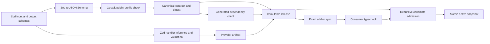

# Zod-derived cross-app contracts experiment

Status: verification prototype. Date: 2026-08-17.

## Context

Gestalt needs one app to publish tool contracts that another app can import, typecheck, install, and invoke without retaining the producer source. The original experiment derived those contracts by walking TypeScript types and maintained a separate validator. This version tests the simpler design: Zod is the authoring and runtime-validation system, while canonical JSON Schema is the immutable release ABI.

## Conclusion

The design is feasible without a bespoke type extractor or validation library. App authors define each input and output once as a Zod schema. Zod supplies handler inference and authoritative runtime validation. Publication accepts a deliberately strict Zod profile, uses Zod’s JSON Schema conversion, canonicalizes and hashes that data, and emits the exact client consumed by dependent apps.

Runtime installation still cannot make static types appear in already compiled code. An add or sync step must resolve one immutable release and materialize its generated client before the consumer is compiled. Zod solves type erasure and validation; the registry, lock, admission, and activation protocols remain necessary distributed-system machinery.

## Authoring

```ts
import { z } from "zod";
import { app, tool } from "@gestalt/sdk";

const GetUserInput = z.strictObject({
  id: z.string(),
});

const GetUserOutput = z.strictObject({
  id: z.string(),
  displayName: z.string(),
  status: z.enum(["active", "disabled"]),
});

export default app({
  tools: {
    getUser: tool({
      input: GetUserInput,
      output: GetUserOutput,
      async handler(input) {
        return {
          id: input.id,
          displayName: "Ada Lovelace",
          status: "active",
        };
      },
    }),
  },
});
```

The handler input and output are inferred from the Zod schemas. There are no parallel TypeScript interfaces, schema objects, or explicit public handler annotations.

## Consumption

```ts
import { users } from "@gestalt/apps/users";

const user = await users.getUser({ id: "42" });
console.log(user.displayName);
```

The generated module is derived from the dependency’s canonical published contract and carries the exact tool-contract digest used by runtime routing.

## Architecture



Publication typechecks the app, executes its declarative app definition to obtain Zod schemas, rejects schemas outside the public profile, and calls `z.toJSONSchema` with Draft 2020-12, input semantics, unrepresentable-type failure, cycle failure, and inline reuse. The release records the Zod, TypeScript, adapter, and Bun versions plus content digests for the manifest, contract, client, source, and executable provider.

The initial public profile supports strict objects, strings, booleans, finite numbers and integers, null, literals, enums, arrays, optional properties, nullable values, unions, and Zod checks that survive JSON Schema conversion. It rejects unconstrained values, coercion, arbitrary refinements, transforms, defaults, open objects and records, recursive schemas, dates, maps, sets, functions, and tuples until their portable semantics are proven. The profile is intentionally conservative: publication fails rather than silently weakening a contract.

## Requirements

### R-TYPE-01 — One canonical public contract

One Zod input and output definition must supply producer inference, runtime validation, canonical JSON Schema, and the importable client without a second author-written schema. Zod and an independent Draft 2020-12 validator must agree over the exercised payload corpus.

### R-TYPE-02 — Reproducible derivation

Equivalent source and pinned toolchain inputs must produce identical canonical contracts, generated clients, source digests, and release contract digests regardless of source path.

### R-TYPE-03 — Closed portable Zod profile

Publication must reject Zod constructs whose accepted values or behavior cannot be reproduced by the canonical release contract. It must never widen an unsupported schema to an unconstrained value.

### R-TYPE-04 — Schema-inferred handlers

Tool handler input and output types must be inferred from the declared Zod contracts, and TypeScript must reject implementations that disagree with them.

### R-PUB-01 — Complete immutable releases

An app coordinate must be publishable only once and must contain the executable artifact, canonical contract, generated client, exact manifest, build identity, and content digests needed to validate and invoke it without producer source.

### R-PUB-02 — Reproducible executable artifacts

Equivalent source and pinned build inputs must produce the same provider artifact digest without retaining non-semantic source-path differences.

### R-DEP-01 — Exact resolvable dependency locks

Every direct dependency must identify one exact immutable app version and contract digest. Version ranges, missing releases, and stale or incompatible contract digests must fail publication.

### R-DEP-02 — Source, manifest, and generated-module alignment

App imports must be static and correspond exactly to direct manifest dependencies. Generated modules must match their locks, and TypeScript must reject calls that violate the imported tool contract. Undeclared, unused, dynamic, stale, and statically invalid references must fail before publication.

### R-DEP-03 — Snapshot pinning

Publishing a newer dependency release must not change an existing consumer’s admitted graph or behavior until the consumer explicitly updates and republishes its lock.

### R-ADM-01 — Recursive graph admission

Installation must expand and validate the complete exact dependency graph and reject cycles before a candidate receives traffic.

### R-ADM-02 — Non-disruptive activation

An initial installation must remain unroutable until admission succeeds, and failure of a later candidate must leave the prior stable activation serving unchanged.

### R-ADM-03 — Release integrity

Admission must reject altered build identities, contracts, generated clients, manifests, or executable artifacts when their content no longer matches published evidence.

### R-E2E-01 — Source-independent cross-app use

A consumer must typecheck, publish, install, and invoke a dependency using only registry artifacts after the dependency source has been removed.

### R-E2E-02 — One contract at compile time and runtime

The Zod-authored contract must drive generated TypeScript definitions and authoritative runtime input and output validation, including unknown-field and dishonest-output rejection.

### R-E2E-03 — Structured invocation failure

Provider, routing, and Zod validation failures must cross the app boundary as stable Gestalt error codes rather than raw library exceptions.

## Verification

The suite contains a golden canonical contract, Zod-versus-Ajv conformance cases, path and artifact reproducibility checks, table-driven public-profile rejection, exact-lock and generated-client alignment checks, a source-deletion functional flow, recursive admission failures, integrity attacks, input and output failures, and stable-to-candidate activation tests. Requirement identifiers in this document are compared automatically with those in the suite, so documentation and executable requirements cannot drift silently.

The decisive flow publishes `acme/users@1.0.0`, removes its source, adds the generated users client to `acme/greeter@1.0.0`, typechecks and publishes the greeter, recursively installs both releases, and invokes the user tool through the generated module. Publishing `acme/users@2.0.0` does not alter the locked greeter.

## Constraints and non-goals

Zod objects are not themselves the durable registry format because the control plane must not execute publisher JavaScript or depend on Zod internals. The immutable ABI is canonical JSON Schema plus build and content evidence. The provider artifact retains Zod for authoritative validation, and publication pins the exact Zod version that produced the contract. This prototype evaluates the declarative app module during publication; a production publisher must do that in a hermetic, credential-free build sandbox and reject installation-time side effects.

This experiment does not implement custom clients, bindings, credentials, authorization policy, streams, sessions, lifecycle hooks, distributed reconciliation, signatures, sandboxing, or compatibility policy beyond exact digest equality. It verifies that Zod can eliminate the speculative type-extraction and bespoke-validation layers without weakening the publication, dependency, admission, or source-independent invocation requirements.
