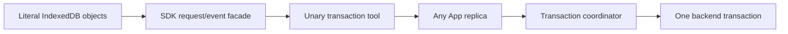

# Zod contracts and literal IndexedDB over Gestalt tools

Status: verification prototype. Date: 2026-08-17.

## Context

Gestalt needs one App to publish tool contracts that another App can import, typecheck, install, and invoke after the producer source is gone. It also needs stateful domain APIs, including IndexedDB transactions and cursors, to work when consecutive calls reach different App replicas.

## Conclusion

Both requirements are feasible without a custom type extractor, validator, or streaming tool. Authors define public inputs and outputs once with [Zod](https://zod.dev/); publication derives a canonical [JSON Schema](https://json-schema.org/draft/2020-12), generated TypeScript client, and immutable release from those schemas.

The ordinary unary `tool` interface can expose the literal [`IndexedDB`](https://www.w3.org/TR/IndexedDB-3/) API. The SDK returns local factory, database, request, transaction, object-store, index, key-range, and cursor objects while translating their operations into calls to one Zod-typed tool. Each stateful call carries a hidden database identity, transaction ID, and sequence, so any App replica can forward it to the coordinator that owns the backend transaction. Streaming would change transport behavior, not the domain API, and is not required for correctness.

This does require a transaction coordinator behind the App replicas. The coordinator, not the JavaScript App replica, owns the live database transaction, enforces command order, retains cursor state, and makes terminal operations idempotent. The proof uses [`fake-indexeddb`](https://github.com/dumbmatter/fakeIndexedDB) as that backend so the experiment can test IndexedDB behavior without claiming a production MySQL implementation.

## Requirements

### R-TYPE-01 — One public contract

One supported Zod input and output definition must provide handler types, runtime validation, canonical JSON Schema, and the generated consumer type. The Zod validator and an independent JSON Schema validator must agree on tested values.

### R-TYPE-02 — Reproducible derivation

Equivalent source and pinned toolchain inputs must produce identical contracts, clients, source digests, and release contract digests regardless of source path.

### R-TYPE-03 — Portable schema profile

Publication must reject schemas that the canonical contract cannot reproduce; it must never weaken them to unconstrained values.

### R-TYPE-04 — Schema-inferred handlers

Handler types must be inferred from their Zod schemas, and TypeScript must reject implementations that disagree with them.

### R-PUB-01 — Complete immutable releases

An App coordinate may be published once and must contain the provider, contract, client, manifest, pinned build identity, and integrity evidence needed after source deletion.

### R-PUB-02 — Reproducible providers

Equivalent source and pinned build inputs must produce the same provider artifact digest without non-semantic source-path differences.

### R-DEP-01 — Exact dependency locks

Every dependency must name one immutable App version and contract digest; ranges, missing releases, and mismatched digests must fail publication.

### R-DEP-02 — Import and manifest alignment

Static App imports must correspond exactly to direct manifest dependencies and generated modules. Undeclared, unused, dynamic, stale, and ill-typed references must fail before publication.

### R-DEP-03 — Snapshot pinning

A new dependency release must not alter an existing consumer until the consumer updates and republishes its lock.

### R-ADM-01 — Recursive graph admission

Installation must verify the complete exact dependency graph and reject cycles before routing traffic.

### R-ADM-02 — Non-disruptive activation

A candidate must remain unroutable until admission succeeds, and its failure must leave the previous active graph unchanged.

### R-ADM-03 — Release integrity

Admission must reject any release whose provider, contract, client, manifest, or build evidence no longer matches its published digest.

### R-E2E-01 — Source-independent App use

A consumer must typecheck, publish, install, and invoke a dependency using registry artifacts after the dependency source is removed.

### R-E2E-02 — One compile-time and runtime contract

The Zod schemas must drive generated TypeScript definitions and runtime input and output validation, including unknown-field and dishonest-output rejection.

### R-E2E-03 — Stable invocation errors

Provider, routing, and validation failures must cross the App boundary as stable Gestalt errors rather than raw library or transport failures.

### R-IDB-01 — Literal IDBDatabase lifecycle

The facade must implement the `IDBDatabase` properties, synchronous `transaction()` return, `close()`, upgrade-only schema methods, event handlers, and required synchronous errors without changing their signatures.

### R-IDB-02 — Replica-independent requests

Literal `IDBRequest` and transaction behavior must survive consecutive commands reaching different App replicas through one ordinary unary tool.

### R-IDB-03 — Literal cursor control

Index cursors and key ranges must use `continue()`, `advance()`, and request events rather than pagination or callback substitutes.

### R-IDB-04 — Upgrade schema changes

`createObjectStore()`, `deleteObjectStore()`, `createIndex()`, and `deleteIndex()` must operate only in a version-change transaction and persist through the coordinator.

### R-IDB-05 — Abort and error semantics

Explicit aborts and failed requests must roll back writes and surface DOMException-compatible request, transaction, and database events.

### R-IDB-06 — Returned IndexedDB objects

The object stores, indexes, key ranges, and mutable cursors returned from `IDBDatabase` must retain their standard properties and method signatures.

### R-IDB-07 — Factory and database upgrades

`IDBFactory` must open, create, discover, compare keys for, upgrade, and delete named databases through `IDBOpenDBRequest`; version changes must support persistent object-store and index renames.

### R-IDB-08 — Portable values and keys

Values must cross the JSON tool boundary with structured-clone graph identity and supported built-in types intact. Keys must cover the complete IndexedDB number, date, string, binary, and recursive-array domain and ordering.

### R-IDB-09 — IndexedDB 3 record retrieval

Object stores and indexes must support direction-aware `getAll()`, `getAllKeys()`, and `getAllRecords()` with their literal option and result shapes.

## App authoring and use

An App author writes Zod contracts and a handler once:

```ts
import { z } from "zod";
import { app, tool } from "@gestalt/sdk";

const GetUser = z.strictObject({ id: z.string() });
const User = z.strictObject({ id: z.string(), displayName: z.string() });

export default app({
  tools: {
    getUser: tool({
      input: GetUser,
      output: User,
      async handler({ id }) {
        return { id, displayName: "Ada Lovelace" };
      },
    }),
  },
});
```

After an exact add or sync step materializes the registry client, a consumer imports it without publishing either App to npm:

```ts
import * as users from "@gestalt/apps/users";

const user = await users.getUser({ id: "42" });
```

The public schema profile supports strict objects, primitive JSON values, literals, enums, arrays, optional and nullable properties, unions, portable checks, and canonical recursive JSON values through `z.json()`. It rejects coercion, transforms, arbitrary refinements, defaults, open records, arbitrary recursion, dates, maps, sets, functions, and other constructs whose canonical behavior has not been proven.

## IndexedDB use

The consumer uses the browser API shape directly. Because an IndexedDB transaction is active while its request event is dispatched, dependent requests are queued in those handlers just as they are in a browser:

```ts
const tx = database.transaction(["accounts"], "readwrite", {
  durability: "strict",
});
const accounts = tx.objectStore("accounts");
const read = accounts.get("from");

read.onsuccess = () => {
  const account = read.result;
  const write = accounts.put({ ...account, balance: account.balance - 25 });
  write.onsuccess = () => tx.commit();
};

tx.oncomplete = () => console.log("committed");
tx.onabort = () => console.error(tx.error);
```

Cursors also retain their standard control methods:

```ts
const tx = database.transaction("tasks");
const request = tx.objectStore("tasks").index("byStatus").openCursor("queued");

request.onsuccess = () => {
  const cursor = request.result;
  if (cursor === null) return;
  console.log(cursor.primaryKey, cursor.value);
  cursor.continue();
};
```

The App exposes only one public `transaction` tool. Factory, begin, request, commit, abort, and status commands are variants of its Zod input and output contract; database identities, transaction IDs, command sequences, cursor IDs, and commit nonces are SDK details and do not appear in the IndexedDB call surface.



## Publication and installation

Publication evaluates the declarative App definition in a build environment, converts its Zod schemas to Draft 2020-12 JSON Schema, rejects unsupported constructs, and records the pinned toolchain and content digests. The registry stores the canonical contract and generated client rather than relying on Zod objects as a durable or language-neutral format.

Adding or syncing a dependency resolves one exact immutable release and materializes its generated module before TypeScript compilation. Runtime installation separately verifies the recursively locked graph and atomically activates it. Static types therefore come from the precompile step; runtime routing follows the same admitted identity and digest.

## Verification

The suite checks Zod and independent-validator agreement, deterministic contract and provider generation, schema-profile rejection, exact dependency locks, generated imports, source deletion, recursive admission, integrity failures, runtime validation, and stable activation. Documentation and tests share requirement IDs and fail if their traceability differs.

The IndexedDB functional tests publish an App containing only the union-shaped `transaction` tool and a separate consumer using literal IndexedDB objects. Factory operations, reads, writes, cursors, commit, abort, and terminal-status checks are routed round-robin across three App replicas to one coordinator. The tests cover factory creation and deletion, upgrades and renames, rollback, the complete key domain, structured-clone graphs, key ranges, indexes, mutable cursors, and IndexedDB 3 record retrieval.

## Implementation details

The facade keeps JavaScript objects, closures, and event handlers in the consumer process; none crosses the tool boundary. The coordinator applies monotonic commands to the backend transaction and records terminal receipts so a lost acknowledgement can be resolved without replaying user code. The prototype uses a keepalive request only because its in-process `fake-indexeddb` backend follows browser transaction activity rules; a production MySQL coordinator would hold the connection explicitly.

Canonical JSON values are represented recursively by `z.json()` and lowered with JSON Schema references. Generated clients name that recursive value type explicitly. Arbitrary recursive domain schemas remain outside the verified profile.

## Remaining work

This is not a browser engine. The facade reproduces the tested request, transaction, database, and upgrade events, but exact browser task scheduling, garbage-collection behavior, multi-connection blocking, event propagation, and every cancellation edge case remain unproven. Those behaviors were intentionally excluded from this verification.

The wire codec covers the IndexedDB key domain and the broadly useful structured-clone types exercised here, including cyclic and shared graphs, sparse arrays, `undefined`, non-finite numbers, `bigint`, dates, regular expressions, maps, sets, errors, buffers and views, blobs, and files. Runtime-specific host objects such as cryptographic keys or filesystem handles need explicit codecs before they can be claimed portable.

The in-memory coordinator proves the unary protocol and literal interfaces, not a production service. Durable replication, failover, MySQL connection recovery, authorization, sandboxing, and a compatibility policy beyond exact digest equality remain outside the experiment.
