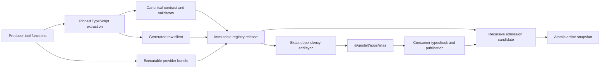

# Type-derived cross-app contracts experiment

Status: verification prototype. Date: 2026-08-17.

## Context

The Gestalt architecture proposes that an app author writes ordinary TypeScript tool functions while publication derives the durable wire contracts, validators, and importable client that other apps use. The uncertain part is not whether TypeScript can describe a function locally. It is whether erased TypeScript types can become stable release artifacts, remain aligned with exact installed app versions, and reject ambiguity early enough that a consumer can safely use another app without its source or a second schema definition.

This experiment tests the smallest complete version of that claim. It deliberately does not change the production SDK or control plane. It lives under the TypeScript SDK as an isolated executable model of compilation, publication, dependency materialization, installation, and invocation.

## Conclusion

The design is possible for a deliberately constrained TypeScript subset. It is not possible through runtime installation alone because TypeScript types no longer exist at runtime. Publication must run a pinned compiler over explicitly annotated public tool signatures, store a canonical wire contract and generated client with the immutable release, and installation tooling must materialize that client into the consumer’s development environment. Within that boundary, a producer does nothing beyond writing its app and annotated tool functions. A consumer still has to declare an exact dependency and import its generated module; an already compiled app cannot acquire new static types merely because another app was installed later.

The prototype proves the positive path without retaining producer source. It also demonstrates why arbitrary TypeScript cannot be promised. Runtime-free refinements, callbacks, index signatures, recursive shapes, unresolved generics, `any`, and `unknown` either lose wire meaning or do not have a finite deterministic schema, so publication rejects them.

## Architecture

The compiler locates a default `app({...})` export and the inline handler in each `tool({...})`. It requires one explicitly typed input parameter and an explicit return type, unwraps `Promise`, and lowers the supported structural types into a sorted closed wire schema. The canonical contract generates both runtime validators and a TypeScript client template. Tool, contract, manifest, client, source, build, and executable artifact evidence is content-addressed.

The registry publishes a coordinate once. An add operation resolves one exact release, records its contract digest in the consumer manifest, and materializes the release client as `@gestalt/apps/<alias>`. Consumer publication verifies that every such import is a declared direct dependency, every declaration is used, the exact release and digest exist, the generated module still matches that release, and the consumer typechecks against it.

Admission recursively expands the locked graph into a candidate, verifies release evidence, rejects missing or incompatible releases and cycles, and imports executable artifacts before a single assignment promotes the candidate. Invocation validates input and output against the published contract. Generated clients route through the installation context, so a dependency edge supplies reachability while the release’s tool contract supplies the call shape.

## Requirements

### R-TYPE-01 — Canonical public contracts

Publication must derive a canonical tool contract and an importable client from explicitly annotated TypeScript handler input and output types without a parallel author-written schema.

### R-TYPE-02 — Reproducible derivation

Equivalent source and pinned compiler inputs must produce identical canonical contracts, generated clients, source digests, and release contract digests regardless of the source path.

### R-TYPE-03 — Closed representable subset

Publication must reject public types whose wire representation is ambiguous or unbounded rather than widening them. The tested rejection boundary includes `any`, `unknown`, callbacks, index signatures, recursive types, and unresolved generics.

### R-TYPE-04 — Explicit public signatures

Every published handler must explicitly annotate its single input and its return type so an inference change cannot silently change a release contract.

### R-PUB-01 — Complete immutable releases

An app coordinate must be publishable only once and must contain the executable artifact, canonical contract, generated client, exact manifest, build identity, and content digests required to validate and invoke it without producer source.

### R-PUB-02 — Reproducible executable artifacts

Equivalent source and pinned build inputs must produce the same provider artifact digest. Build output must not retain non-semantic source-path differences.

### R-DEP-01 — Exact resolvable dependency locks

Every direct dependency must identify one exact immutable app version and contract digest. Version ranges, missing releases, and stale or incompatible contract digests must fail publication.

### R-DEP-02 — Source, manifest, and generated-module alignment

App imports must be static and correspond exactly to direct manifest dependencies, generated modules must match their locked releases, and TypeScript must reject calls that do not satisfy the imported tool definition. Undeclared, unused, dynamic, stale, and statically invalid references must fail before publication.

### R-DEP-03 — Snapshot pinning

Publishing a newer dependency release must not change an existing consumer’s admitted graph or behavior until that consumer explicitly updates and republishes its lock.

### R-ADM-01 — Recursive graph admission

Installation must expand and validate the complete exact dependency graph and reject cycles before the candidate can receive traffic.

### R-ADM-02 — Non-disruptive activation

An initial installation must remain unroutable until admission succeeds, and failure of a later candidate due to missing or invalid dependencies must leave the prior stable activation serving unchanged.

### R-ADM-03 — Release integrity

Admission must reject altered build identities, contracts, generated clients, manifests, or executable artifacts when their content no longer matches the published evidence.

### R-E2E-01 — Source-independent cross-app use

A consumer must typecheck, publish, install, and invoke a dependency using only registry artifacts after the dependency’s TypeScript source has been removed.

### R-E2E-02 — One contract at compile time and runtime

The derived contract must drive both the generated TypeScript definitions and runtime input and output validation, including rejection of unknown fields and dishonest handler outputs.

### R-E2E-03 — Structured invocation failure

Provider and routing failures must cross the app boundary as stable structured error codes rather than unclassified exceptions.

## Verification method

The suite contains a golden compiler contract, path-reproducibility checks, table-driven negative extraction cases, publication and lock tests, a source-deletion functional flow, recursive admission failures, integrity attacks, runtime input and output failures, and stable-to-candidate activation checks. Each executable requirement carries the same identifier as this document. A traceability test compares the identifiers in this document with those in the test suite so either side fails when requirements drift.

The decisive functional flow publishes `acme/users@1.0.0`, deletes its source, adds its generated client to `acme/greeter@1.0.0`, typechecks and publishes the greeter, recursively installs both releases, and invokes the greeter through the generated users client. A separately published `acme/users@2.0.0` does not affect the locked greeter.

## Findings and counterexamples

The experiment supports structural data contracts, not all TypeScript semantics. Branded primitives collapse to their wire primitive unless brand metadata is represented separately. Numeric integer constraints, string formats, validation refinements, transforms, class behavior, overloaded functions, conditional and mapped types, open dictionaries, and recursive graphs require an explicit policy or rejection. Named producer types are re-emitted as generated structural client types; their original module identity is not portable.

The first reproducibility check also found that Bun’s readable bundle embeds the entrypoint path and derives symbol names from its filename. The toy removes that non-semantic input by minifying the release artifact. This proves reproducibility across paths in the exercised environment, not across operating systems or future Bun releases. A production design still needs a hermetic build root, pinned toolchain artifacts, and cross-machine reproducibility tests.

The global invocation hook is intentionally a minimal transport seam, not a production isolation or authorization model. The toy does not address custom clients, bindings, credentials, authorization policy, streams, sessions, lifecycle hooks, distributed reconciliation, signatures, sandboxing, or schema-evolution compatibility beyond exact digest equality. Those concerns can be layered after the type-to-release hypothesis is accepted; they are not evidence that erased TypeScript types can be recovered at runtime.

## Decision

Proceed with a production spike only if Gestalt is willing to define and version a conservative public TypeScript subset and make publication compilation authoritative. Do not describe the feature as types appearing from installed apps. Describe it as immutable releases carrying generated clients, with dependency add/sync materializing the exact client before the consumer is compiled. The next spike should focus on the canonical schema specification, compatibility rules, hermetic compiler packaging, and diagnostics for unsupported types.
